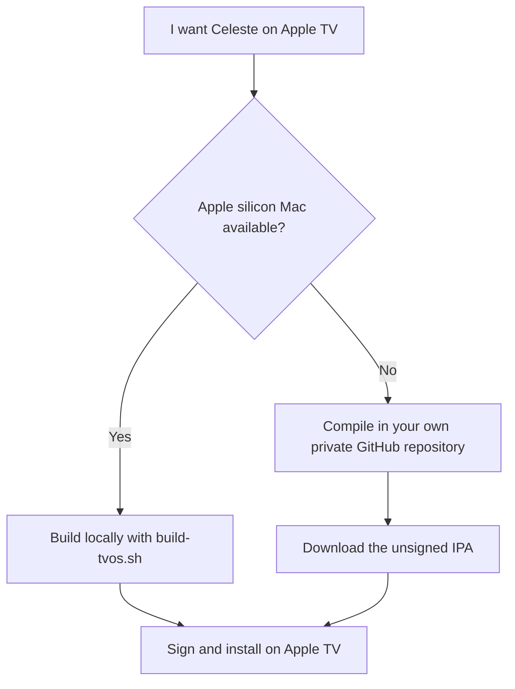

# Celeste for Apple TV

An unofficial community port that builds a native Apple TV version of Celeste
from game files you already own. It provides full controller gameplay, Metal
graphics, FMOD audio, durable saves, and Apple TV-specific menus and lifecycle
behaviour.

The port is mature and playable. It has been extensively tested on an Apple TV
4K (3rd generation, 128 GB) and supports tvOS 16.0 or later. Other arm64 Apple
TV models may work, but have not received the same physical acceptance.

This repository does **not** contain Celeste or the proprietary FMOD SDK. You
supply both from your own accounts; the builder validates them and produces the
Apple TV app locally or in your own private GitHub repository.

## Start here

You need:

1. An unmodified supported **Celeste 1.4.0.0 FNA** download from itch.io,
   Steam, or Epic Games Store.
2. **FMOD Engine iOS/tvOS 1.10.09 build 97915** from FMOD.
3. A way to compile:
   - an Apple silicon Mac for the local builder, or
   - your own private GitHub repository for cloud compilation.
4. A way to sign and install the app on your Apple TV. A cloud-built IPA is
   unsigned and cannot be installed until it is signed.

The guides below explain each part. You do not need to understand FNA, AOT, or
the native dependency pipeline to follow them.

## Choose how you want to build



### Easiest if you do not have a Mac

Use the [private GitHub cloud builder](docs/CLOUD_BUILDING.md). GitHub supplies
the macOS build machine, so Windows and Linux users can compile a
**signing-ready unsigned IPA** without owning a Mac.

You create your own repository from the public template and make it private,
then upload one Celeste ZIP and the original FMOD DMG. The workflow refuses to
read inputs in a public repository, keeps the output private, and includes a
cleanup workflow for the input and output Releases. It never asks for Steam,
Epic, FMOD-account, or Apple-signing credentials.

Cloud compilation does **not** sign or install the app. You still need a
tvOS-capable signing and installation method afterward.

→ **[Build in the cloud](docs/CLOUD_BUILDING.md)**

### Build locally on a Mac

On a supported Apple silicon Mac, [`./build-tvos.sh`](build-tvos.sh) validates
the inputs, builds the native and managed code, and can either:

- sign and install directly using an Apple Account and a paired Apple TV;
- create an unsigned IPA; or
- do both.

The accepted setup uses full Xcode, .NET SDK 10.0.302 with tvOS workload set
10.0.302.0, GNU Make, and Mono. The host doctor reports missing tools without
requiring Celeste or FMOD:

```bash
./build-tvos.sh --check-host
```

CMake, Ninja, and ripgrep are **not** required. See the prerequisite checklist
and copyable clone commands in the [local build guide](docs/BUILDING.md).

## Step 1 — Get your Celeste files

The builder supports nine exact **Celeste 1.4.0.0 FNA** input profiles from
itch.io, Steam, and Epic Games Store across the tested Linux, macOS, and Windows
packages. It detects the actual contents automatically rather than trusting a
folder name.

The simplest choice depends on the store you own it on:

- **itch.io:** download one of the listed unmodified 1.4.0.0 FNA packages.
- **Steam:** the recommended route uses Steam's built-in console to download
  the tested Linux depot; it is only input for the builder and is not run on
  your Mac.
- **Epic Games Store:** obtain one tested Mac or Windows package from your own
  account; an optional Legendary-based route is documented.

Everest/modded, XNA, mixed, unknown, and other-version installations are not
currently supported. The validator rejects them instead of risking a broken
build.

→ **[Choose and obtain supported Celeste files](docs/CELESTE_INPUTS.md)**

## Step 2 — Get FMOD

Download exactly **FMOD Engine iOS/tvOS 1.10.09 build 97915** from the
[official version-specific FMOD Engine page](https://www.fmod.com/download?version=1.10.09#fmodengine).

- Choose **FMOD Engine**, not FMOD Studio.
- Choose the **iOS** package; it contains the tvOS libraries this project uses.
- Use version **1.10.09** (also written **1.10.09, build 97915**), not FMOD 2.x
  or another release.
- FMOD may ask you to sign in before it shows the older download.

Download it through your own FMOD account and keep the DMG outside the
repository. The project validates it but does not redistribute it.

## Step 3 — Build

- **Apple silicon Mac:** follow [Build locally](docs/BUILDING.md), then run
  `./build-tvos.sh`.
- **Windows, Linux, or no suitable Mac:** follow [Build in the
  cloud](docs/CLOUD_BUILDING.md) to create the unsigned IPA privately.

The local builder has eight numbered phases, privacy-safe progress heartbeats,
and full logs under ignored `dist/logs/`. If it stops, start with
`dist/logs/last-error.txt`.

## Step 4 — Sign and install

### Local direct install

With an Apple Account configured in Xcode, a paired developer-ready Apple TV,
and a stable bundle identifier, the local builder can provision, sign, install,
launch, and verify Celeste. A free Personal Team is sufficient, although its
development provisioning normally expires after about seven days and then
needs re-signing.

### Unsigned IPA

Local IPA mode and the cloud builder both produce
`Celeste-tvOS-unsigned.ipa`. Its conventional `Payload/Celeste.app` layout is
ready for a tvOS-capable signer, but it has no usable signature or provisioning
profile and cannot be installed directly. Signing tools and services are
outside this project's control; keep the same final bundle identifier if you
want replacement installs to retain the same save domain.

See [Building](docs/BUILDING.md#build-and-install-modes) for the accepted local
install flow and [Troubleshooting](docs/TROUBLESHOOTING.md#unsigned-ipa-will-not-install-directly)
for unsigned-package help.

## What works?

### Gameplay

- Native arm64 tvOS gameplay with Metal rendering
- Real FMOD music, ambience, UI sounds, effects, and cutscene audio
- Extended-controller movement, Jump, Dash, Grab, menus, cutscene skip, and
  rumble; DualSense was physically tested
- Durable Settings and all three normal save slots
- Transparent compressed storage with recovery generations; Existing v1 installs require no manual migration

### Apple TV integration

- **Options → Controller Prompts** for Automatic, Xbox, PlayStation, Nintendo
  Switch, and Stadia on-screen button artwork; this changes artwork only, not
  mappings
- **Options → Performance HUD** for Apple's native Metal diagnostics
- A safe **Leave Celeste** flow instead of the old desktop-style blank screen
- Locally generated layered app icon and Top Shelf artwork

### Save management

- Explicitly activated same-network Save Manager
- One-time QR pairing, plus the manual address and six-digit-code fallback
- Download/backup, validated replacement, slot deletion, and Settings reset
- Confirm-driven verified soft reload without restarting the FNA runtime

### Building

- Local Mac build, signing, and direct install
- Private GitHub compilation for an unsigned IPA
- Exact multi-store input recognition and reproducible downstream generation

The technical acceptance matrix is in [Project status](docs/STATUS.md).

## Save Manager

Open **Options → Save Manager**, make sure your phone or computer is on the
same local network, and scan the QR code on the TV. The browser opens the
authenticated manager without typing the six-digit code. A numeric address and
code remain available as a fallback.

The server is dormant during normal gameplay and starts only while its menu is
open. It can back up or replace the four normal Celeste files (Settings and
slots 0–2). After a successful change, press Confirm on the Apple TV; Celeste
verifies the imported state and returns to a functional main menu. If that
verification fails, fully close the app from the Apple TV app switcher and
reopen it.

The displayed local address normally stays the same when Save Manager is
closed and reopened. An already open browser page notices when the manager is
closed or reopened and disables its controls until you reconnect. Every new
activation still uses fresh authentication, so reconnect with the new QR code
or access code rather than relying on an old page.

Save Manager is a temporary local-network tool, not cloud sync. Saves are
shared between Apple TV users in the same app installation, do not survive an
uninstall, and are not backed up to iCloud.

## Supported game versions

Only the nine listed unmodified Celeste 1.4.0.0 FNA profiles are supported.
They normalize to one locked downstream game, but that does not mean every
release from those storefronts is accepted. Review the [exact profile
matrix](docs/CELESTE_INPUTS.md) if validation rejects your files.

Everest/mod support and XNA inputs are not currently supported. The modern
self-builder targets tvOS; the legacy iOS source remains in the repository but
is not a current modern-iOS build path.

## Current limitations

- Personal-use self-build only; no App Store distribution is provided.
- The cloud result is unsigned and requires separate signing and installation.
- Free Personal Team installs generally need re-signing after about seven days.
- Apple User Management is unavailable with Personal Team provisioning, so
  saves are shared between Apple TV users.
- There is no iCloud/cloud-save sync or uninstall-survival guarantee.
- DualSense is the physically accepted controller; the Siri Remote is not an
  intended gameplay controller.

More precise tested-versus-compatible boundaries are in
[Project status](docs/STATUS.md).

## Troubleshooting

Start with the [beginner issue index](docs/TROUBLESHOOTING.md#common-questions)
for game-file, FMOD, cloud, signing, save, and Save Manager problems. Build
failures name a complete log and write a privacy-safe summary to
`dist/logs/last-error.txt`.

Never post Celeste files, FMOD files, signed apps/IPAs, Apple credentials,
provisioning profiles, certificates, Team IDs, or device identifiers in an
issue.

## For developers

The beginner path is intentionally short; the engineering detail is still
available:

- [Documentation hub](docs/README.md)
- [Project status and architecture](docs/STATUS.md)
- [Advanced local build and reproducibility](docs/BUILDING.md)
- [Native dependency pipeline](native/README.md)
- [Contributing](CONTRIBUTING.md)
- [Development and acceptance history](docs/history/README.md)

The original Xamarin.iOS project is retained for provenance and legacy work.
The beginner/public builder remains tvOS-only; developers can also inspect the
[experimental modern iOS lane](docs/IOS_FOUNDATION.md), which now reaches real
Celeste's title/menu with a controller but is not yet a finished iOS port.

## Project history and release candidates

- [v1.0.0-rc.2 release notes](docs/releases/v1.0.0-rc.2.md)
- [Current release-candidate manifest](tvos/release-candidates/v1.0.0-rc.2.json)
- [Chronological engineering history](docs/history/README.md)

Historical stage reports record how the port was proven. They are useful for
debugging and reproducibility, but are not required reading to build the app.

## Credits and legal boundary

This work builds on
[RoootTheFox/celeste-ios](https://github.com/RoootTheFox/celeste-ios) and its
contributors, including the original FNA/iOS port and native build foundation.
Celeste is by Extremely OK Games / Maddy Makes Games. Runtime and native work
uses [FNA](https://github.com/FNA-XNA/FNA),
[SDL](https://github.com/libsdl-org/SDL),
[FNA3D](https://github.com/FNA-XNA/FNA3D),
[FAudio](https://github.com/FNA-XNA/FAudio),
[Theorafile](https://github.com/FNA-XNA/Theorafile),
[MoltenVK](https://github.com/KhronosGroup/MoltenVK),
[FMOD](https://www.fmod.com/), and the
[FMOD-SDL bridge](https://github.com/flibitijibibo/FMOD_SDL).

This is an unofficial community project and is not endorsed by Extremely OK
Games, Maddy Makes Games, FMOD, or Apple. Celeste game files, generated Celeste
source, and FMOD SDK material are not distributed here. The repository
[`LICENSE`](LICENSE) applies only to the covered repository source; third-party
software and content retain their own terms.
