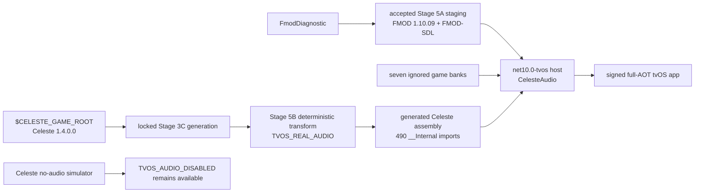

# Celeste tvOS Stage 5B: normal-game FMOD audio

## Result

Stage 5B passes. A separately selectable, signed `CelesteAudio` configuration
uses the generated Celeste 1.4.0.0 FMOD API, the externally supplied FMOD
Engine 1.10.09 tvOS SDK, the real FMOD-SDL bridge and the seven validated game
banks. It ran with full trimming, full device AOT and `UseInterpreter=false` on
the paired Apple TV 4K (3rd generation).

Machine evidence confirms native and Studio initialization, bank loading,
music, ambience, UI and gameplay event creation, settings-volume readback, the
real Prologue music cue, scene transitions, lifecycle pause/resume and orderly
shutdown. The user separately confirmed that the requested normal-game audio
matrix sounded correct, including music, effects, volume and mute changes,
with no audible distortion.

This result does **not** provide durable saves, durable settings, Apple TV
per-user separation, complete controller certification, or distribution
packaging. It does not claim that every bank event was exercised.

## Scope and commits

- Branch: `tvos-port`
- Starting commit: `e9134d8129c5d3bf7b97c42c598f85df2e3cdc23`
- Final commit: the commit containing this report, with subject
  `feat: enable Celeste audio on tvOS`
- Supported game input: exact unmodified FNA Celeste `1.4.0.0`
- `Celeste.exe` SHA-256:
  `fd73f8a2311fa5737ded550cbad4b75c85b7686b36432f59185e940fcb65fcfe`
- Game content: 1,216 files, 1,158,665,183 bytes, aggregate SHA-256
  `30a1c147d1a3ab0aa45762094e393ed7fd69951dd66e5af063447641e0699c46`
- FMOD input: external FMOD Engine `1.10.09`, build `97915`
- Managed API: generated FMOD `1.10.20`
- Host: .NET SDK `10.0.302`, workload set `10.0.302.0`
- Apple toolchain: Xcode `26.6`, tvOS SDK `26.5`, minimum tvOS `16.0`

All input and runtime paths in this report are symbolic. `$CELESTE_GAME_ROOT`
and `$FMOD_SDK_ROOT` are user-owned external inputs. No absolute private path,
signing identity, team, account, provisioning UUID, bundle identifier or
device identifier is recorded here.

## Architecture

`CelesteAudio` is an explicit, device-only launch mode. It is independent of
the accepted no-audio and FMOD-diagnostic modes:



The project rejects `CelesteAudio` for any RID other than `tvos-arm64`. It also
rejects a missing Stage 5B generated tree, an unexpected FMOD directory in the
ordinary generated Content tree, missing accepted Stage 5A staging, an invalid
scenario, or missing banks. FMOD native references and banks enter only the
device audio graph.

The preserved launch modes are:

- `Stage2Diagnostic`
- `CelestePreflight`
- `Celeste` (normal no-audio game)
- `CelestePrologueDiagnostic` (no-audio)
- `FmodDiagnostic`
- `CelesteAudio`

`CelesteAudio` supports `normal`, `prologue-normal` and `prologue-skip`
acceptance scenarios. The Prologue scenarios use the established real game
route and do not substitute isolated FMOD event calls for gameplay.

## Deterministic managed generation

`scripts/prepare-celeste-tvos-stage5b.sh` performs a fresh locked Stage 3C
generation, copies that output into a separate ignored Stage 5B tree, restores
the original generated FMOD extern declarations, maps them to `__Internal`,
selects the real high-level `Celeste.Audio`, restores real Prologue cue calls,
and adds focused instrumentation and lifecycle corrections. It does not edit
generated files in place by hand and does not read the mounted FMOD SDK.

The generation policy locks:

- Stage 3C input: 927 files, logical SHA-256
  `a5ffcde2252c527d71bae43418751ff8dbf100bf2aa344c7400e7b722f2341c7`
- restored FMOD imports: 490 (`fmod`: 320, `fmodstudio`: 169,
  `fmod_SDL`: 1)
- accepted Stage 5A logical input SHA-256:
  `b32fc89dbefdda69ab7bf20ea9ece37826dce51787a4f70446493e292b12603d`
- Stage 5B output: 928 files, logical SHA-256
  `4e4e96f3d15815430a2f8ad063a4c4cdff004273b7513cf972d56ecd0b04460d`

Two independent, complete clean preparations produced identical normalized
managed and preparation manifests. Generated source, assemblies, content,
FMOD inputs and build outputs remain ignored.

The generator fails if both `TVOS_REAL_AUDIO` and `TVOS_AUDIO_DISABLED` are
selected, if neither high-level implementation is selected, if the expected
490-import API changes, or if any focused source transformation loses its
locked match.

## Managed 1.10.20 and native 1.10.09 compatibility

The managed and native version discrepancy is preserved rather than hidden:

| Evidence | Value |
| --- | --- |
| Generated managed header | `0x00011014` (1.10.20) |
| Physical native runtime | `0x00011009` (1.10.09) |
| FMOD SDK build | `97915` |
| Restored generated imports | 490 |
| Imports exported by native 1.10.09 | 489 |
| Sole absent import | `FMOD_DSP_GetCPUUsage` |

`FMOD_DSP_GetCPUUsage` is 1.10.20 DSP telemetry with no caller outside its
generated wrapper. Full trimming removes it from the executable. It was not
fabricated, stubbed, renamed or redirected. Every generated import reachable
by Celeste is supplied by the real native archives, including
`FMOD_Studio_EventInstance_TriggerCue` and `FMOD_SDL_Register`.

Physical runtime returned FMOD 1.10.09, registered FMOD-SDL against the Studio
low-level system, and initialized both the low-level and Studio systems. No
`ERR_VERSION`, missing entry point or native resolution failure occurred.

## Native and bank inputs

Stage 5B reuses, without rebuilding, the Stage 5A staging and its real
FMOD-SDL bridge. The six-symbol Ogg/Vorbis localization policy remains
unchanged. No fake or no-op FMOD symbol provider exists.

Normal game startup loads the exact case-sensitive banks in this order:

| Order | Bank | Events | Buses | VCAs |
| ---: | --- | ---: | ---: | ---: |
| 1 | `Master Bank.bank` | 69 | 118 | 3 |
| 2 | `Master Bank.strings.bank` | 0 | 0 | 0 |
| 3 | `music.bank` | 70 | 0 | 0 |
| 4 | `sfx.bank` | 527 | 0 | 0 |
| 5 | `ui.bank` | 105 | 0 | 0 |
| 6 | `dlc_music.bank` | 16 | 0 | 0 |
| 7 | `dlc_sfx.bank` | 135 | 0 | 0 |
| **Total** | **7 banks** | **922** | **118** | **3** |

The banks total 665,721,576 bytes. They are staged from the validated game
installation only into ignored Stage 5A and app-output directories. The app
contains one copy of each bank and never reads a bank from an external path at
runtime. No no-audio app contains FMOD banks or symbols.

The 922-event inventory is a bank enumeration, not an assertion that every
event was played.

## Focused generated-source behavior

The audio-enabled graph compiles the original high-level `Celeste.Audio`
implementation. It restores real systems, banks, buses, VCAs, listeners,
snapshots, music, ambience and one-shot instances. The Stage 3B/3C no-audio
implementation and all low-level guards remain intact in the independently
selectable no-audio graph.

Focused instrumentation records bounded aggregate events for initialization,
bank load, event create/start/stop/release, parameters, buses, VCAs, cues,
snapshots, listener-update heartbeats and shutdown. It does not log every
sound or every frame.

Two compatibility corrections were required:

1. Celeste applies a shared optional parameter set to event variants that do
   not all declare every parameter. FMOD returns `ERR_EVENT_NOTFOUND` for those
   non-applicable parameters and the original game intentionally ignores the
   result. These are now bounded `event-parameter-not-applicable` observations;
   every other non-OK FMOD result remains fatal evidence.
2. `IntroVignette.StopSfx()` could be called twice for the same already
   released handle. The focused transform makes cleanup idempotent by checking
   and clearing that instance. This prevents `ERR_INVALID_HANDLE` without
   changing the normal first stop/release behavior.

No broad exception swallowing or error-code suppression was added.

## Physical normal-game evidence

### Initialization and rendering

- Full-AOT, fully trimmed, `UseInterpreter=false`: pass.
- Development signing, installation and launch: pass using the existing
  ignored primary personal-team configuration.
- Renderer: FNA3D Metal on the physical Apple TV GPU.
- Stage 2 native self-tests and tvStubs call count: pass; zero tvStubs calls.
- Low-level and Studio systems: initialized.
- FMOD-SDL: registered.
- All seven banks: loaded.
- Audio heartbeats: continued throughout accepted runs.

### Title, UI and gameplay

Machine-observed normal play created and started:

- title/level-select music and world-map ambience;
- UI first-input, navigation, select, back and panel-transition sounds;
- Prologue music and ambience;
- jump, dash, climb/grab-related and other representative player effects;
- pause/dialogue snapshots;
- Chapter 1 music/ambience after the Prologue;
- death and revive paths during repeated death/respawn cycles.

Persistent-event heartbeats remained bounded through scene changes and
repeated deaths. Old scene music and ambience emitted stop/release operations,
and no duplicate persistent music was observed or heard. This validates the
representative route, not every possible event or late-game transition.

### Settings volume

The Music VCA and gameplay/UI SFX VCAs were changed through zero,
intermediate values and full volume during normal play. FMOD readback matched
the requested value, including `0.00`, `0.50` and `1.00`, without an app
restart. Pause snapshots and bus state returned to the expected unpaused state
after resume. Settings still use the accepted temporary serializer and are not
durable across a fresh process.

### Prologue cue and transitions

Separate signed physical runs covered normal completion and cutscene skip.

| Gate | Normal | Skip |
| --- | --- | --- |
| Real `event:/music/lvl0/bridge` instance | Pass | Pass |
| Real `triggerCue()` | Pass | Pass |
| Temporary SaveData operation | Pass | Pass |
| Tutorial haptic start/stop | Pass | Pass |
| Next scene | `Celeste.Overworld` | `Celeste.Overworld` |
| Post-transition advancing frames | 69.924 s | 69.905 s |
| FMOD shutdown completed | Pass | Pass |

There was no black screen, null music instance, stuck FMOD event, stuck haptic
or unhandled exception. This directly regresses the Stage 3C boundary with real
audio instead of the no-audio cue adaptation.

### Pause, cutscenes and lifecycle

Normal game logs show pause/dialogue snapshots, bus changes, stop/release
operations on transition and restored playback after pause. A focused physical
lifecycle run read the root bus as paused on resign-active and unpaused after
becoming active. Music continued correctly after foreground without duplicate
persistent instances.

The user confirmed expected pause/resume, background/foreground and normal
termination behavior. No audio was heard after termination. Separate automated
Prologue runs reached `audio-shutdown-completed`; a clean second physical
launch loaded all banks and produced seven real-audio heartbeats over 70
seconds.

### Controller and haptic smoke

The requested smoke route exercised movement, Jump, Dash, Grab, Confirm,
Cancel, Pause, cutscene skip and representative rumble. Death and tutorial
haptic start/stop events remained bounded. Audio integration did not weaken
the Stage 3C haptic expiry and cleanup path. This is a smoke regression, not
complete controller certification.

## User audible confirmation

The user completed the requested physical normal-game sequence and reported:

- all audio worked as intended;
- music was audible;
- UI and gameplay sound effects were audible;
- Prologue and transition audio behaved correctly;
- volume changes and mute/unmute were audible;
- pause/resume and lifecycle behavior were correct;
- there was no distortion, severe crackling, duplicate music or audio after
  termination.

This is human-observed audible evidence. FMOD logs independently establish
the runtime state and event categories. The confirmation does not imply an
audible test of every bank event.

## Simulator and prior-stage regression

The arm64 simulator remains deliberately no-audio because the user-supplied
FMOD 1.10.09 simulator archives are x86_64-only.

- Debug and trimmed Release no-audio Celeste builds: pass.
- A 90-second trimmed normal-game run, background/foreground and clean second
  launch: pass.
- Package inspection: TVOS Simulator arm64; zero FMOD symbols and zero banks.
- Stage 3C Prologue normal route: pass, including 73.169 seconds after the
  transition on the first run and 69.950 seconds on the second.
- Stage 3C Prologue skip route: pass, including 73.515 seconds after the
  transition on the first run and 69.977 seconds on the second.
- `CelestePreflight`: Settings, SaveData, focused reflection and all seven XNB
  readers pass; zero FMOD low-level guards and zero tvStubs calls.
- `Stage2Diagnostic`: Metal rendering, native self-tests, frame heartbeats and
  background/foreground pass.
- Stage 5A static staging validation: pass and accepted logical hash unchanged.

Stage 1 was not rebuilt. The accepted Stage 1 logical SHA-256 remains
`61c1d97b7a585144b2b60ec0ed46f2d70f1f6239ec1732a17cc3101c3293fe39`.
The existing iOS project, native archives and build path are unchanged.

## AOT, trimming, signing and package layout

The accepted device publish uses:

- `Release`
- `tvos-arm64`
- full AOT
- full trimming
- `UseInterpreter=false`
- development signing through ignored local configuration

Static verification proves:

- one arm64 `TVOS` executable, minimum tvOS 16.0, SDK 26.5;
- accepted Stage 1 native exports;
- real FMOD low-level, Studio and FMOD-SDL exports;
- no iOS, simulator or desktop slice;
- no loose `.dll`, `.so` or `.dylib` native payload;
- no FMOD SDK headers;
- exactly seven banks, without duplicate hashes;
- no generated source, temporary settings, SaveData, profiles or signing data.

Measured package layout:

| Item | Size |
| --- | ---: |
| App allocation | 1,171,204 KiB (about 1.12 GiB) |
| Complete `Content` allocation | 1,134,048 KiB (about 1.08 GiB) |
| FMOD banks allocation | 650,132 KiB (about 635 MiB) |
| Main executable | 30,420,992 bytes (about 29.0 MiB) |

No bank conversion, recompression or optimization was attempted.

## Failed attempts and corrections

1. The first signed launch reached the project preflight check but that check
   still rejected any FMOD directory. The check was made mode-specific: the
   no-audio lane still rejects FMOD, while `CelesteAudio` requires exactly the
   accepted staged banks.
2. The first broad physical run exposed optional per-event parameter returns
   as `ERR_EVENT_NOTFOUND`. Source inspection proved the original game ignores
   these variant-specific results. They are now explicitly classified while
   unrelated FMOD failures remain errors.
3. The same run found two stop/release calls for the Intro vignette sound.
   Focused idempotent cleanup removed the invalid second operation.
4. Initial lifecycle readback was sampled before Studio applied the queued
   bus command. A Studio command flush was added before diagnostic readback;
   physical results are now `true` on resign-active and `false` on active.
5. An evidence parser initially searched for `trigger-cue`, while the bounded
   event emitted `event-trigger-cue`. The parser was corrected; both Prologue
   runs independently contain the real cue call.
6. One reproducibility comparison paired a complete preparation with a
   managed-only preparation and correctly reported their content-mode
   difference. The required complete-versus-complete clean comparison passes.
7. Historical Stage 2/3 wrapper privacy scans treat the already committed
   open-source FMOD-SDL license-author address as if it were private signing
   data. The license notice was retained unchanged. The underlying static,
   build and runtime gates were run directly, and the new Stage 5B scanner
   distinguishes proprietary/private material from a required license notice.
8. Final staged verification showed that the Stage 5A verifier protected the
   entire `managed` directory, which necessarily includes new Stage 5B policy
   and templates. Its isolation check now names the exact accepted Stage 3
   files instead. Stage 5B pins the revised verifier hash and the complete
   Stage 5A static check passes; no Stage 3 input was relaxed or changed.
9. Generated-project restore may print a nonfatal preliminary “project not
   found” message for its relative FNA adapter path before the repository-owned
   `FNA.TvOS` project is resolved and built. The final builds and references
   succeed; this warning remains documented rather than hidden.

No attempt used interpreter mode, globally disabled trimming, a blanket linker
root, a fake FMOD library or a Stage 1 rebuild.

## Rebuild and verification commands

Prepare the already validated external FMOD input once as documented by Stage
5A, then regenerate and publish Stage 5B:

```bash
scripts/validate-celeste-input.sh --game-root "$CELESTE_GAME_ROOT"
scripts/validate-fmod-tvos-sdk.sh --sdk-root "$FMOD_SDK_ROOT"

scripts/prepare-fmod-tvos.sh \
  --sdk-root "$FMOD_SDK_ROOT" \
  --game-root "$CELESTE_GAME_ROOT" \
  --clean

scripts/prepare-celeste-tvos-stage5b.sh \
  --game-root "$CELESTE_GAME_ROOT" \
  --clean

dotnet publish tvos/CelesteTvOSRuntimeHost/CelesteTvOSRuntimeHost.csproj \
  -c Release -r tvos-arm64 \
  -p:CelesteLaunchMode=CelesteAudio \
  -p:Stage5BAudioScenario=normal \
  -p:UseInterpreter=false \
  -p:RunAOTCompilation=true \
  -p:PublishTrimmed=true

scripts/verify-celeste-tvos-stage5b.sh \
  --app tvos/CelesteTvOSRuntimeHost/bin/Release/net10.0-tvos/tvos-arm64/CelesteTvOSRuntimeHost.app
```

Run the ignored, user-assisted physical lane with:

```bash
scripts/run-celeste-tvos-game-audio-acceptance.sh \
  --app tvos/CelesteTvOSRuntimeHost/bin/Release/net10.0-tvos/tvos-arm64/CelesteTvOSRuntimeHost.app \
  --test normal
```

Use `--test lifecycle`, `--test prologue-normal`, `--test prologue-skip` and
`--test second-launch` with matching published scenarios for focused evidence.
All device identifiers, console logs and answers stay below ignored evidence
directories.

## Remaining Stage 6 work

Stage 6 must replace process-temporary settings and SaveData with the planned
tvOS durable bridge. It must materialize normal files in a session directory,
serialize the small durable set into UserDefaults, use atomic replacement or
multiple generations, restore before Celeste startup, and flush at normal save,
resign-active, background and termination boundaries. It must test malformed
and interrupted writes, migrations, reinstall/profile limitations and audio
settings persistence.

Apple TV current-user separation and the User Management entitlement remain a
separate Stage 7 gate. Neither entitlement nor iCloud KVS is present here.

## Isolation and licensing

Tracked Stage 5B material consists only of policy, deterministic transforms,
templates, host integration, verification/runner scripts and this report.
The external FMOD SDK, its headers and archives, the seven banks, all Celeste
content/binaries/generated source, local signing configuration, provisioning
profiles, temporary settings/SaveData, screenshots and raw device logs remain
ignored and uncommitted.

FMOD remains subject to the user's external FMOD license. Celeste content and
game binaries remain user-owned and are not redistributed. The real FMOD-SDL
bridge retains its committed open-source license notice.

## Final classification

### Verified facts

- deterministic generated source and native inputs;
- full-AOT trimmed signed package correctness;
- managed/native symbol closure for every reachable generated FMOD API;
- physical initialization, bank loads, representative event state, settings
  readback, Prologue cue/transitions, lifecycle and shutdown;
- simulator no-audio isolation and prior-stage focused regressions;
- absence of proprietary or private material from tracked files.

### User-observed facts

- representative music and effects were audible and behaved as intended;
- volume and mute changes were audible;
- no distortion, severe crackling, duplicate music or post-termination audio
  was observed.

### Inferred or intentionally unverified

- unvisited levels and the remainder of the 922 enumerated events should use
  the same proven API path, but were not individually exercised;
- durability, per-user separation and distribution behavior remain unverified
  until their later stages.
