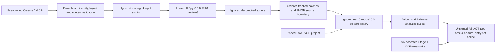

# Celeste tvOS managed retarget — Stage 3A report

## Result

Stage 3A passes its compile-time acceptance gates. The exact supported user-owned Celeste 1.4.0.0 input was validated, independently regenerated twice, retargeted to modern .NET tvOS, compiled in Debug and Release, analysed under trimming/AOT analyzers, and rooted through an unsigned `tvos-arm64` full-AOT link closure. The two clean runs produced equivalent normalized manifests.

This result does **not** mean Celeste was started, rendered a frame, or is playable. The closure harness creates a delegate to the future entry boundary so the linker sees the reachable graph, but it never invokes that delegate. No app from this stage was signed, installed, or launched.

The runtime-sensitive findings are deliberately still visible: Settings/SaveData XML serialization needs an AOT-safe runtime path; reflected type discovery needs evidence-driven roots; desktop-only behavior needs focused tvOS decisions; and the Stage 3A FMOD boundary throws if any native FMOD call is reached. Those belong to Stage 3B or Stage 5 as identified below.

## Baseline and toolchain

| Item | Verified value |
|---|---|
| Starting commit | `3b1d516709b4bd7d45a1e86aa84780fbba817fba` |
| Branch | `tvos-port` |
| Stage 3A commit | The commit containing this report; resolve with `git rev-parse HEAD` after checkout. A SHA cannot be embedded in the commit that determines it. |
| Host | macOS 26.3 (`25D5087f`), arm64 |
| .NET SDK | `10.0.302` selected by the existing `global.json` |
| Workload set | `10.0.302.0`; tvOS manifest `26.5.10301/10.0.100` |
| Xcode | 26.6 (`17F113`) |
| tvOS SDK | 26.5 |
| Deployment baseline | tvOS 16.0 |
| Decompiler | repository-local `ilspycmd` `8.0.0.7246-preview3`; reported ILSpy/decompiler version `8.0.0.7246` |
| Decompiler package SHA-256 | `9f2fe20986177e444b4bd9126a37514b073d49646a2df71b750d4a839cb97424` |
| Pinned FNA source | `d52b4ce61e4086b785c51a96d331dbf106975a58` |
| Accepted Stage 1 logical SHA-256 | `61c1d97b7a585144b2b60ec0ed46f2d70f1f6239ec1732a17cc3101c3293fe39` |

The baseline was clean after preserving an unrelated Finder metadata file outside the repository. The branch, expected starting commit, recursive submodule state, SDK, workload and previous-stage verification were checked before implementation. No SDK, workload, Homebrew package, global .NET tool or native dependency was installed or upgraded.

## Supported user input

The pipeline accepts one exact, unmodified, non-Everest FNA release and rejects anything else.

| File/evidence | Verified value |
|---|---|
| Game version | `1.4.0.0`, proven by the approved executable hash and regenerated constructor `new Version(1, 4, 0, 0)` |
| `Celeste.exe` identity | `Celeste, Version=1.0.0.0`; SHA-256 `fd73f8a2311fa5737ded550cbad4b75c85b7686b36432f59185e940fcb65fcfe` |
| `Celeste.Content.dll` identity | `Celeste.Content, Version=0.0.0.0`; SHA-256 `0b8d6195992c8970e8602bf48a7bf89104b83a98e34a07dc0c18d01581711d15` |
| Game-provided FNA identity | `FNA, Version=21.3.5.0`; SHA-256 `00349b572636c0ed4c97d4e4f74344b3450160c42d4a6b52bcf5e0f2d5193a31` |
| Legacy managed architecture | PE32 Mono/.NET assemblies; suitable as legacy AnyCPU-compatible decompiler input, not copied as target binaries |
| Celeste assembly references | `FNA 21.3.5.0`, `mscorlib`, `System`, `System.Core`, `System.Xml` |
| Content inventory | 1,216 files; 1,158,665,183 bytes |
| Content-tree SHA-256 | `30a1c147d1a3ab0aa45762094e393ed7fd69951dd66e5af063447641e0699c46` |
| Everest/MonoMod markers | 0 |

The privacy-safe manifest writes the source as `$CELESTE_GAME_ROOT`. It records no library path, account metadata or save files. Only the three managed input assemblies are staged below the ignored build directory; `Content/` is hashed and inspected in place but never copied.

`Celeste.Content.dll` contains zero defined types and zero embedded resources. The modern pipeline therefore reconstructs an identity-only `Celeste.Content` library with version `0.0.0.0`; it does not distribute or embed the input DLL. The actual game content remains external and is not included in the AOT closure.

## Locked generation architecture



`.config/dotnet-tools.json` locks the exact tool package. `managed/celeste-generation.lock.json` locks the accepted input identities and hashes, decompiler command, FNA revision, Stage 1 hash, patch order, expected decompiled/patched file counts and logical hashes, expected FMOD import count, project templates and normalization rules. Tool restore uses ignored repository-local `DOTNET_CLI_HOME` and `NUGET_PACKAGES` directories.

The raw ILSpy project contains host-runtime reference hint paths. Only that demonstrated volatile field is normalized in the decompiled logical manifest. The raw generated project is then removed and replaced by tracked templates. File modification times, raw log paths, PE/Mach-O timestamps and UUIDs are not treated as logical source evidence.

The tracked compatibility transforms use zero-context unified diffs so nested tab-indented source context does not create whitespace defects in the patch files themselves. Their safety comes from exact input/tool hashes, locked before-and-after logical source hashes, noninteractive forward-only patching, and a clean regeneration test—not from fuzzy matching.

Every managed-pipeline script rejects explicit generated or artifact paths unless Git confirms they are inside ignored repository locations. Clean replacement also requires a pipeline marker, so generated source cannot be redirected into a reviewable source directory or erase an unrelated directory.

Two clean outputs were generated under:

- `.build/celeste-managed/rebuild-a/`
- `.build/celeste-managed/rebuild-b/`

Their privacy-safe evidence is under the corresponding ignored `artifacts/celeste-managed/` directories. No generated source or binary is tracked.

## Generated project and FNA integration

The generated Celeste project is a library targeting `net10.0-tvos26.5`. A platform-qualified target is required because its project reference is the Stage 2 Apple-platform adapter, `tvos/FNA.TvOS/FNA.TvOS.csproj`; a platform-neutral `net10.0` library cannot reference that tvOS-specific project.

The project:

- preserves `Celeste, Version=1.0.0.0`;
- exposes `Celeste.Celeste.Run(string[])` as the controlled Stage 3B boundary;
- references the pinned project-built FNA assembly, not `$CELESTE_GAME_ROOT/FNA.dll`;
- contains no `net452`, `mscorlib.dll`, .NET Framework reference assembly or legacy game-binary hint path;
- enables trim and AOT analyzers without a preserve-all descriptor;
- uses deterministic compilation and a generated-root `PathMap`;
- defines `TVOS` and the explicit compile-only `TVOS_AUDIO_DISABLED` boundary;
- does not use an interpreter or disable trimming.

The modern output references .NET 10 BCL assemblies and `FNA, Version=21.3.5.0`; it has no `mscorlib` reference. The AOT app's `FNA.dll` differs from the locked game-provided FNA hash and is the Stage 2 project output.

The sibling `tvos/CelesteManagedAotClosure` project references the generated Celeste and identity-only Celeste.Content projects, `FNA.TvOS`, and the same six accepted Stage 1 XCFrameworks as Stage 2. It uses full trimming, `UseInterpreter=false`, tvOS 16.0 and signing disabled. Its static delegate roots the callable entry graph but `Main` only keeps that delegate alive and returns.

## Compatibility ledger

The machine-readable ledger has seven focused entries: two legacy .NET Framework API differences, and one each for AOT/reflection, XML/serialization, launcher/entrypoint behavior, native interop, and assembly-discovery reflection.

| Change | Original failure/category | Focused behavior | Stage 3B validation |
|---|---|---|---|
| Existing `crash-fixes.patch` reflection portion | Entry assembly is the host, not the Celeste library | Discovery owned by Celeste uses `Assembly.GetExecutingAssembly()` | Compare tracked, pooled, Oui and command discovery sets |
| Existing Settings comment patch | XML serializer compatibility | Removes only a non-state informational XML comment property | Settings round-trip |
| Public library boundary | Decompiled executable has a private `Main` | Rename to `Run(string[])`; do not invoke in Stage 3A | Invoke only through the proven SDL/tvOS lifecycle |
| BinaryFormatter boundary | `SYSLIB0011`; disabled legacy API | Binary mode throws `PlatformNotSupportedException`; XML mode retained | Confirm normal startup never reaches Binary mode |
| AssemblyInfo cleanup | `System.Security.Permissions` is unavailable | Remove an unused namespace import | Verify assembly identity/metadata |
| Generic Enum/Marshal overloads | Type-based calls produce avoidable AOT analysis | Use equivalent generic overloads for statically known types | Area/journal tests; FMOD marshaling waits for Stage 5 |
| FMOD compile boundary | Full-AOT native link initially produced undefined FMOD symbols | Replace only generated FMOD extern declarations with explicit managed throws; record every symbol | Stage 3B must bypass/replace `Audio.Init`; Stage 5 restores native FMOD |

No Steam-removal patch was carried: the exact supported FNA input has no Steamworks reference or Steam API call sites. No iOS virtual-controller patch was carried. No save-path, User Management or durable-storage change was introduced.

## FMOD compile-only boundary

The managed FMOD API reconstructed from the user's executable reports `0x00011014`, FMOD 1.10.20. The planned user-supplied native SDK remains FMOD 1.10.09 from the earlier audit. That mismatch is preserved and is not “fixed” by an upgrade in Stage 3A.

The first rooted device-AOT attempt failed at the native link, beginning with `_FMOD_SDL_Register` and FMOD Studio symbols. This was correct: modern Apple AOT had made reachable P/Invoke wrappers concrete native dependencies, while Stage 3A prohibits native FMOD.

The deterministic source transform now replaces exactly 490 generated native declarations with managed methods that throw `PlatformNotSupportedException`:

| Import name | Count |
|---|---:|
| `fmod` | 320 |
| `fmodstudio` | 169 |
| `fmod_SDL` | 1 |

This is not a fake native library, does not provide FMOD symbols, contains no proprietary implementation, and fails loudly if reached. The exact managed API source stays ignored with the rest of the generated source. The AOT closure contains no FMOD-named file or native symbol provider, and no claim about audio is made.

Stage 3B may introduce a separate, explicit source-level no-audio startup bypass to reach a first frame. Native audio, the managed/native version compatibility decision, and all audio validation remain Stage 5.

## Reflection, content, serializer and native-import inventory

The combined generated-Celeste and pinned-FNA static inventory contains 125 dynamic/native sites:

| Kind | Sites |
|---|---:|
| Native imports in pinned FNA source | 84 |
| Delegate/member reflection | 11 |
| Unmanaged callbacks | 11 |
| `Assembly.GetTypes` discovery | 7 |
| XML serializer construction | 7 |
| `Activator.CreateInstance` | 3 |
| `Type.GetType` | 2 |

Classification totals are 84 native-resolution sites, 21 focused-preservation sites, 17 deferred sites, 2 runtime-rewrite sites, and 1 target-unreachable site. Generated Celeste has zero remaining native imports after the explicit FMOD boundary; Stage 1/Stage 2 continue to provide SDL2, FNA3D, FAudio, Theorafile and MoltenVK/Vulkan imports.

The user content contains 14 XNB files. Header inspection, without copying the files, identifies seven dynamic FNA reader types: `CharReader`, `EffectReader`, `ListReader<T>`, `RectangleReader`, `SpriteFontReader`, `Texture2DReader`, and `Vector3Reader`. Stage 3B must load representative assets for all seven under device AOT before claiming first-frame content readiness.

Serializer roots are deliberately narrow:

- `Celeste.Settings`: reachable before first frame; requires an AOT-safe runtime serializer path.
- `Celeste.SaveData`: required for later save work; requires the same before Stage 6.
- `Celeste.Session`: used by a debug command; the command must be proven unreachable on the target.

The current `XmlSerializer` calls retain IL2026/IL3050 warnings. No blanket linker descriptor, preserve-all assembly root or global trim disable was added. A tvOS runtime serializer smoke test was not claimed in this compile-only stage; the policy requires a temporary-data Settings/SaveData round-trip on device before Stage 3B can pass.

Reflected Oui, tracked/pooled entities, commands, spawn handlers and dynamic delegate targets are inventoried. Static analysis alone cannot safely infer all inherited discovery roots, so Stage 3B must compare pre-trim and post-trim discovery sets and add only exact roots proven necessary.

## Desktop/platform inventory

Lexical inventory found the following legacy assumptions:

| Area | Sites | Decision boundary |
|---|---:|---|
| Keyboard | 159 | Defer controller-focused behavior to Stage 4; do not delete keyboard code merely to compile |
| Mouse | 38 | Must remain unreachable or harmless on tvOS |
| Save-path selection | 8 | No change in 3A; Stage 6 owns the tvOS save bridge |
| Rich presence/store/Stadia | 7 | Must be isolated from normal tvOS startup |
| Linux/BSD paths | 5 | Target-unreachable |
| macOS desktop paths | 4 | Target-unreachable |
| Process/shell behavior | 3 | Needs explicit tvOS behavior if reachable |
| Windows paths | 2 | Target-unreachable |
| Steam API | 0 | Supported input is already non-Steam |
| tvOS virtual controller | 0 | The iOS virtual-controller patch is not enabled |

No generated Celeste OpenGL-only call site was detected; graphics still requires Stage 3B runtime evidence through the Stage 2 Metal/FNA path.

## tvStubs reachability

All 25 Stage 1 tvStubs exports were compared with generated Celeste, pinned FNA and the staged cross-platform SDL binding:

- generated Celeste call sites: 0;
- pinned FNA textual occurrences: 4, all in `WEB`-only Emscripten declarations/calls excluded by the tvOS symbols;
- staged SDL binding occurrences: 19 declarations or non-tvOS wrappers;
- remaining stub exports: no managed occurrence in this pinned graph.

Result: no intended tvOS call path reaches tvStubs. The stubs remain link-closure compatibility exports, not runtime implementations. Stage 3B runtime logging should continue to treat any stub invocation as a failure.

## Build, trim and full-AOT results

Both clean sets passed:

| Gate | Result |
|---|---|
| Modern Celeste Debug build | Pass, 0 errors |
| Modern Celeste Release build with trim/AOT analyzers | Pass, 0 errors |
| `Celeste.Content` identity build | Pass |
| Unsigned `tvos-arm64` full-AOT publish | Pass |
| Interpreter | Disabled |
| Trim mode | Full |
| Celeste entry invocation | Never invoked |
| Signing/install/launch | Not performed |
| Native FMOD | Absent |
| Celeste Content/save data | Absent |
| Native executable | One arm64 Mach-O, platform `TVOS`, minimum 16.0, SDK 26.5 |
| Other native formats/slices | No ELF, loose `.so`, `.dylib`, `.a`, iOS, simulator or desktop-native payload |
| Code signature/profile | None; app is unsigned and has no embedded provisioning profile |

The app contains managed PE assemblies and matching `.aotdata` as normal modern .NET Apple AOT inputs. Those PE containers are managed metadata/IL, not Windows native binaries. The only Mach-O is the tvOS arm64 executable.

The normalized diagnostic baseline has 163 unique warnings and zero errors:

| Family | Counts |
|---|---|
| C# reconstruction/layout | CS0169 22; CS0219 3; CS0649 29; CS8632 2; CS8981 15 |
| Code quality/platform | CA1416 9; CA2014 2; CA2022 6; CA2200 1 |
| Trim/reflection | IL2026 32; IL2045 4; IL2046 1; IL2057 4; IL2062 1; IL2065 5; IL2067 2; IL2070 2; IL2072 1; IL2075 6; IL2087 1; IL2090 1 |
| AOT dynamic code | IL3050 14 |

`managed/celeste-analysis-policy.json` matches all 163 records to focused rules with rationale and a Stage 3B test. It suppresses no warnings. The policy result is 163 explained, 0 unexplained. Runtime-sensitive warnings remain visible instead of being hidden behind blanket annotations.

## Reproducibility

The clean runs produced the same:

- validated input manifest;
- generated file list and normalized decompiled source hashes;
- patched file list and source hashes;
- tool/version and patch-order manifest;
- 490-entry FMOD boundary manifest;
- reflection, serializer, content-reader, native-import, platform and tvStubs inventories;
- normalized compiler/trim/AOT diagnostics and policy coverage;
- logical full-AOT closure metadata;
- build-result metadata.

Key logical values:

| Evidence | Value |
|---|---|
| Decompiled files | 920 |
| Normalized decompiled SHA-256 | `db7b722159fbdef8625c81608165aea162957dce956fcd5b16eeceaa1089a273` |
| Patched/generated project files | 922 |
| Patched logical SHA-256 | `127ed90934780c2af00ad497d875a6ca03f9c5a185761b4da82366578e1bd5b0` |
| Normalized manifests compared | 15 |
| Comparison result | Equivalent |

After the preparation output guard was hardened, one additional clean preparation, managed build and unsigned full-AOT closure pass reproduced the same 15 logical manifests without changing either acceptance rebuild or any native input. The identical guard was then added to the build and verification entrypoints; focused rejection/pass tests cover that wrapper-only change, while the already-verified build body is unchanged.

Compiled PE/Mach-O byte identity is not claimed because Apple/.NET tooling embeds timestamps, paths and UUIDs. The comparison normalizes only documented volatile fields and does not excuse unexplained source, diagnostic or metadata differences.

## Failed and abandoned approaches

1. Rooting the real generated entry graph without an FMOD boundary reached the native link and failed on undefined FMOD symbols. Adding native FMOD or fake symbols would violate Stage 3A, so the focused source-level throwing boundary replaced the generated imports.
2. An exploratory attempt to redirect the closure project's base intermediate directory caused duplicate generated assembly attributes because the old `obj/` directory was no longer in the SDK default exclusion set. That output isolation approach was abandoned. The final script performs a normal `dotnet clean` of the isolated closure project before restore/publish.
3. An exact global ILSpy tool happened to exist on the audit host. The final pipeline does not rely on it; the repository tool manifest and ignored package/cache roots are authoritative.

No failed attempt modified the user input, Stage 1/2 sources, the iOS lane or a Git submodule.

## Previous-stage and legal isolation

Focused Stage 1 and Stage 2 verification passed without rebuilding native libraries or rerunning runtime acceptance. The accepted native logical hash is unchanged. The Stage 2 host remains buildable and its simulator scene remains available. Existing iOS project/build files, checked-in iOS native archives, FNA and native-builder submodules, and Stage 1/2 reports are unchanged.

Licensing/distribution boundaries:

- Celeste source, managed binaries and Content are user-owned inputs; all staged/generated forms are ignored and must not be committed or redistributed.
- FMOD managed API source is reconstructed locally from the user's input and stays ignored. No FMOD native library, header or SDK content is present. FMOD licensing and version compatibility remain user-supplied Stage 5 inputs.
- ILSpy `8.0.0.7246-preview3` declares the MIT license in its locked NuGet metadata.
- FNA and the six Stage 1 open-source native dependencies remain governed by the exact pinned revisions and license inventory from Stages 1 and 2.
- No signing identity, profile, Team ID, account, device identifier or local signing property is read into a tracked artifact.

## Commands

Set the path to the user's supported unmodified FNA installation only in the shell:

```bash
export CELESTE_GAME_ROOT=/path/to/user-owned/celeste
```

Validate only:

```bash
scripts/validate-celeste-input.sh --game-root "$CELESTE_GAME_ROOT"
```

One clean generation/build/verification:

```bash
scripts/prepare-celeste-managed.sh \
  --game-root "$CELESTE_GAME_ROOT" \
  --build-dir .build/celeste-managed/current \
  --artifact-dir artifacts/celeste-managed/current \
  --clean

scripts/build-celeste-managed.sh \
  --build-dir .build/celeste-managed/current \
  --artifact-dir artifacts/celeste-managed/current

scripts/verify-celeste-managed.sh \
  --build-dir .build/celeste-managed/current \
  --artifact-dir artifacts/celeste-managed/current
```

Two independent logical-reproducibility sets:

```bash
for name in rebuild-a rebuild-b; do
  scripts/prepare-celeste-managed.sh \
    --game-root "$CELESTE_GAME_ROOT" \
    --build-dir ".build/celeste-managed/$name" \
    --artifact-dir "artifacts/celeste-managed/$name" \
    --clean
  scripts/build-celeste-managed.sh \
    --build-dir ".build/celeste-managed/$name" \
    --artifact-dir "artifacts/celeste-managed/$name"
done

scripts/verify-celeste-managed.sh \
  --build-dir .build/celeste-managed/rebuild-a \
  --artifact-dir artifacts/celeste-managed/rebuild-a \
  --compare-dir artifacts/celeste-managed/rebuild-b
```

These commands install nothing globally. Tool-package restore is exact and local to the selected ignored build directory.

## Stage 3B boundary and blockers

Stage 3B may begin only as a separate reviewable change. Its minimum unresolved runtime work is:

1. Add an explicit temporary no-audio startup path before invoking `Celeste.Celeste.Run`; the current compile-only FMOD methods intentionally throw.
2. Replace or prove an AOT-safe Settings serializer and run a device round-trip in ignored temporary storage. Keep SaveData roots ready for Stage 6 without implementing durable saves yet.
3. Record and compare reflected Oui, tracked/pooled, spawn and command discovery sets; add only focused preservation roots.
4. Load representative XNB files for all seven inventoried reader types under device AOT.
5. Isolate process/shell and rich-presence/store behavior from tvOS startup.
6. Retain the Stage 2 SDL lifecycle, native-import self-test, Metal/FNA graphics evidence, tvStubs failure audit and background/foreground behavior.
7. Package user content only from `$CELESTE_GAME_ROOT` into ignored/local runtime output; never commit it.

Unverified until Stage 3B: Celeste entry execution, settings deserialization, content loading, reflected type completeness, first rendered frame, crash behavior, controller interaction and lifecycle behavior with Celeste loaded. Audio remains unverified until Stage 5, durable saves until Stage 6, and per-user data separation until Stage 7.
