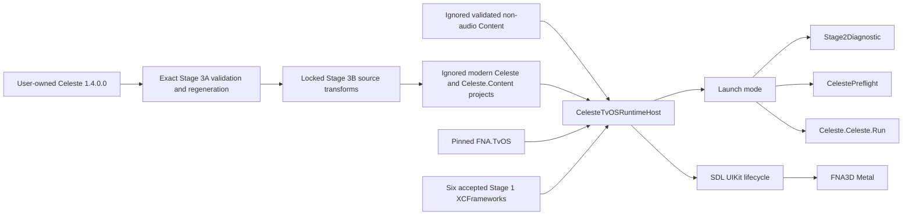

# Celeste tvOS first-frame runtime — Stage 3B report

## Result

Stage 3B passes all required acceptance gates. The exact supported user-owned Celeste 1.4.0.0 input was regenerated through the Stage 3A pipeline, transformed through a locked Stage 3B policy, and integrated into a separate modern `net10.0-tvos` host. A trimmed arm64 simulator build and a development-signed, full-AOT arm64 device build both pass Settings, reflection, seven-reader XNB and native-interoperability preflight tests. Both invoke `Celeste.Celeste.Run(string[])`, enter the real Celeste update/draw loop, render through FNA3D Metal, reach `Celeste.Overworld`, sustain advancing Celeste-owned frames for more than 90 seconds after the first draw, recover from background/foreground, and pass a clean second launch.

Audio is deliberately disabled. No FMOD native library, header, bank, framework, archive or symbol provider is linked or staged. The 490 generated low-level managed FMOD methods remain counted fail-fast guards and were reached zero times. This result does not claim functional audio, final controller behavior, durable saves, Apple TV user separation, gameplay completion or App Store readiness.

| State | Value |
|---|---|
| Starting commit | `7a761643904ad2b4bcbc1fae85c19a21d3fc93cc` |
| Branch | `tvos-port` |
| Stage 3B commit | The commit containing this report; resolve with `git rev-parse HEAD` after checkout. A commit cannot embed its own SHA. |
| Stage result | PASS |
| Native dependencies rebuilt | No |
| Celeste/FMOD/private material tracked | No |

## Toolchain and target

| Item | Verified value |
|---|---|
| Host | macOS 26.3 (`25D5087f`), arm64 |
| .NET SDK | `10.0.302`, selected by `global.json` |
| Workload set | `10.0.302.0` |
| tvOS workload manifest | `26.5.10301/10.0.100` |
| Xcode | 26.6 (`17F113`) |
| tvOS device/simulator SDK | 26.5 / 26.5 |
| Deployment baseline | tvOS 16.0 |
| Pinned FNA | `d52b4ce61e4086b785c51a96d331dbf106975a58` |
| Stage 1 logical SHA-256 | `61c1d97b7a585144b2b60ec0ed46f2d70f1f6239ec1732a17cc3101c3293fe39` |
| Physical target | paired Apple TV 4K 3rd generation, model `AppleTV14,1` |

No SDK, workload, Xcode component, native dependency, Homebrew package or global tool was installed or upgraded. Stage 1 artifacts were reused from the accepted ignored artifact sets.

## Exact user-owned input

The input validator accepts only the locked, unmodified, non-Everest FNA release:

| Evidence | Verified value |
|---|---|
| Game version | `1.4.0.0`, from the approved executable hash and regenerated `Version(1, 4, 0, 0)` construction |
| `Celeste.exe` identity | `Celeste, Version=1.0.0.0`; SHA-256 `fd73f8a2311fa5737ded550cbad4b75c85b7686b36432f59185e940fcb65fcfe` |
| `Celeste.Content.dll` identity | `Celeste.Content, Version=0.0.0.0`; SHA-256 `0b8d6195992c8970e8602bf48a7bf89104b83a98e34a07dc0c18d01581711d15` |
| Game FNA identity | `FNA, Version=21.3.5.0`; SHA-256 `00349b572636c0ed4c97d4e4f74344b3450160c42d4a6b52bcf5e0f2d5193a31` |
| Original Content tree | 1,216 files; 1,158,665,183 bytes; aggregate `30a1c147d1a3ab0aa45762094e393ed7fd69951dd66e5af063447641e0699c46` |
| Everest/MonoMod markers | 0 |

The privacy-safe manifest represents the source only as `$CELESTE_GAME_ROOT`. The log line `CELESTE : 1.4.0.0` is the runtime game-version evidence; the generated modern assembly intentionally retains the legacy assembly identity `Celeste, Version=1.0.0.0`.

## Runtime architecture



`tvos/CelesteTvOSRuntimeHost` is a sibling SDK-style project. It does not replace or edit the Stage 2 host. It links the proven Stage 2 lifecycle, native self-test, lifecycle monitor and diagnostic scene source files, references the existing `FNA.TvOS` adapter, and consumes the same six accepted static XCFrameworks. The launch mode is an explicit build property:

- `Stage2Diagnostic`: the unchanged geometric Stage 2 scene;
- `CelestePreflight`: Settings, discovery, XNB and graphics tests without invoking Celeste;
- `Celeste`: direct invocation of `Celeste.Celeste.Run(string[])` from the proven SDL main callback.

There is one UIKit/SDL lifecycle. The Celeste entrypoint is not invoked through reflection. The existing static SDL callback and modern Apple callback-preservation annotation remain the AOT boundary.

## Deterministic generation and content staging

`scripts/prepare-celeste-tvos-runtime.sh` reruns exact input validation and the complete Stage 3A regeneration before applying `scripts/celeste-stage3b.py`. Direct edits to generated source are neither required nor accepted. The policy locks the Stage 3A input, compile symbols, transform list, Settings field set, content selection and expected Stage 3B output.

| Logical evidence | Value |
|---|---|
| Stage 3A patched files/hash | 922 / `127ed90934780c2af00ad497d875a6ca03f9c5a185761b4da82366578e1bd5b0` |
| Stage 3B generated files/hash | 925 / `0dcc35b9a2b55fd69174a450db9fb21d7ebab9a7e092ccae75810d9041374dee` |
| Staged Content | 1,209 files; 492,943,607 bytes (492.9 MB decimal, 470.1 MiB) |
| Staged Content aggregate | `0c2802322adb06f2281ca7f8358d56c75e6a5c48ba759171f4dc51a5c049d348` |
| Excluded FMOD bank tree | 7 files; 665,721,576 bytes |
| Signed app allocation | approximately 506.5 MiB on the development Mac |

The content stager preserves case-sensitive relative paths, rejects escaping symlinks, rejects save/log/Everest material, hashes every copied file, and stages every validated Content file except `Content/FMOD`. It performs no conversion or recompression. `Graphics/Atlases/Misc/fmod.data` is a legitimate locked game-content atlas metadata file; it is not a bank or native FMOD input.

Two independent clean runs under ignored `rebuild-a` and `rebuild-b` roots produced byte-identical privacy-safe input, managed, content and preparation manifests and logically identical managed trees. No unexplained normalization was needed.

## Explicit no-audio boundary

`TVOS_AUDIO_DISABLED` compiles the original high-level `Celeste.Audio` implementation out and compiles a removable inert implementation. `TVOS_STAGE3B` selects the other first-frame adaptations. The high-level boundary covers:

- initialization, update and unload;
- bank-load requests;
- listener/camera requests;
- `Play`, `Loop`, instance creation and event-description lookup;
- event pause, resume, position, parameter, stop and state queries;
- bus pause/mute/stop and VCA volume state;
- snapshot creation/control;
- music, alternative music and ambience transitions;
- music/SFX volume, pause and underwater state.

Ordinary event/handle requests return the inert generated FMOD managed value (`null` for the generated reference-type wrappers), while state-bearing music, ambience, volume and pause operations preserve the values Celeste reads back. Aggregate categories are logged at a bounded interval rather than every frame. The accepted device run recorded expected requests such as initialization, six bank-load attempts, music/ambience transitions, volume/pause and parameter updates.

All 490 generated lower-level FMOD methods remain in managed generated source. Stage 3B changes their throws only to route through `TvOSStage3Bridge.FmodLowLevelReached`, which increments a counter, logs the exact unexpected symbol and fails immediately. Simulator preflight, device preflight, both sustained runs and both second launches report zero low-level calls.

The generated managed API corresponds to FMOD 1.10.20 (`0x00011014`), while the planned user-supplied native SDK remains 1.10.09. The discrepancy remains explicit. Stage 3B neither upgrades FMOD nor tests native compatibility. Stage 5 must remove the no-audio boundary and resolve that exact managed/native pairing under the FMOD licence.

## AOT-safe Settings serialization

`TvOSSettingsSerializer` is an explicit reflection-free serializer for the locked Celeste 1.4.0.0 public Settings field graph. A transform-time field-set check fails generation if that graph drifts. It preserves the legacy root/field representation, enum compatibility spellings and keyboard/controller binding lists. It prohibits DTD processing, rejects unknown/duplicate/nonconforming elements and wraps malformed XML as `InvalidDataException`.

Only `Celeste.Settings` is routed through this serializer. Stage 3B deliberately throws if `UserIO` attempts generic `SaveData` serialization or deserialization. A host-supplied per-process directory under the application temporary root provides ignored, non-durable test storage. This is not the Stage 6 save bridge.

The following pass in trimmed simulator Release and device full AOT:

| Test | Result |
|---|---|
| No existing file gives first-run defaults | PASS |
| Default write/read round trip | PASS |
| Representative non-default values and bindings | PASS |
| Actual `UserIO.Save`/`Load` temporary round trip | PASS |
| Malformed value and unknown element rejection | PASS |
| Representative legacy Settings XML | PASS |

## Reflection discovery and focused roots

The Debug reference, trimmed simulator Release and full-AOT physical preflight emit the same sorted count/hash for all ten discovery categories:

| Category | Count | SHA-256 |
|---|---:|---|
| Oui types | 10 | `04d92579a7f6393c7867e8e632e5843a4cf31cb24af17046aad83b259738b52a` |
| Tracked roots | 119 | `e2feb1746bd266b81a6a9e5b60ab2ade0573edace2db9550b15f838399b6ed2d` |
| Tracked expanded | 180 | `4272ab69ba06f09c583b8cf6a55dd0cb50b0ccaf7624a2126def0da6db928857` |
| Tracker initialized actual | 177 | `0f6e9f4aabe065810f37ee4289a97864cd91ac960d9e7ae97456247cd7ccb326` |
| Pooled roots | 12 | `e8e3e500bc572c39035ed0cd89cd3d435cb4a1575e067e92e9a64eb9e259d084` |
| Pooler initialized actual | 12 | `e8e3e500bc572c39035ed0cd89cd3d435cb4a1575e067e92e9a64eb9e259d084` |
| Spawnable types | 0 | `e3b0c44298fc1c149afbf4c8996fb92427ae41e4649b934ca495991b7852b855` |
| Spawner methods | 0 | `e3b0c44298fc1c149afbf4c8996fb92427ae41e4649b934ca495991b7852b855` |
| Initialized spawn actions | 0 | `e3b0c44298fc1c149afbf4c8996fb92427ae41e4649b934ca495991b7852b855` |
| Command methods | 75 | `5ef019aacb1f89ae49e41cae9c07423276488d19f6bb94c262bb3fe94339dac2` |

The linker descriptor contains 196 exact Celeste type-metadata nodes, 22 exact reflected constructors, 75 exact command methods and seven exact FNA reader types. It does not root the Celeste assembly as a whole and does not use preserve-all at assembly scope. The initial trimmed preflight returned empty discovery sets; the measured focused roots corrected that failure.

Release simulator and device logs contain the same 16 unique linker diagnostic sites across eight IL codes. `managed/celeste-stage3b-warning-policy.json` explains every site; the evidence verifier reports zero unlisted diagnostics. No warning is globally suppressed.

- Celeste Commands, Oui, Tracker and Pooler reflection warnings are covered by the exact cross-runtime set equality above.
- FNA content-reader and vertex-declaration warnings are covered by the real seven-reader preflight and sustained Metal rendering.
- `System.Private.Xml` is covered for Settings by the six-case serializer test.
- `CmdLogSession` retains two `XmlSerializer` warnings. It is a desktop debug command discovered for parity but not invoked in the accepted path; SaveData/Session serialization remains explicitly unavailable until Stage 6.
- the FNA default desktop window-title metadata warning is unreachable on the SDL/UIKit-owned tvOS path.

## Seven-reader XNB preflight

Two exact user-owned assets exercise all seven Stage 3A-inventoried reader types through the real FNA `ContentManager` path:

| Asset | SHA-256 | Loaded object | Reader evidence |
|---|---|---|---|
| `Effects/Border.xnb` | `055a66a81f73a1774432d3d6f410c811df5372f9243b346f5541c4253ec87393` | `Effect`, with at least one technique | `EffectReader` |
| `Monocle/MonocleDefault.xnb` | `28fe2928006120440659862f889723fc052e56ed73c6faa449b24232e132494a` | `SpriteFont`, non-empty characters/line spacing/measurement | `CharReader`, `ListReader<T>`, `RectangleReader`, `SpriteFontReader`, `Texture2DReader`, `Vector3Reader` |

The first real preflight failed when the validated SpriteFont XNB named `ListReader<System.Char, mscorlib>`. Modern .NET has no legacy `mscorlib` identity. A Stage 3B-only FNA extension registers that one exact locked spelling with a direct `new ListReader<char>()` constructor. It is imported only into the Stage 3B FNA project graph; the FNA submodule and Stage 2 adapter remain unchanged. All seven readers pass on trimmed simulator and full-AOT device.

## Desktop and platform behavior

| Area | tvOS decision |
|---|---|
| Child process/shell launch | General launch fails explicitly with `PlatformNotSupportedException`; no launch occurred |
| Error-log file opening | Logged once and suppressed; error data stays in the ephemeral session root |
| `GCSettings.LatencyMode` | Unsupported `SustainedLowLatency` assignment suppressed after an observed simulator `PlatformNotSupportedException` |
| Thread priority changes | Scheduling hints suppressed; thread creation/work/join/failure propagation retained |
| Rich presence/store/Stadia | Not reached in accepted startup/title flow |
| Windows/Linux/macOS helpers | Target-unreachable in accepted path |
| Desktop window title/manipulation | Host plist and SDL/UIKit lifecycle own tvOS presentation |
| Keyboard/mouse assumptions | Not deleted; no input is required to reach the accepted title flow |
| iOS virtual controller | Not enabled on tvOS |
| Save path | Temporary Stage 3B session only; no durable-save behavior claimed |

All 25 tvStubs exports remain linked only as Stage 1 compatibility closure. Source analysis and every runtime self-test report zero intended call sites and zero invocations.

## Simulator acceptance

The accepted target was an arm64 Apple TV 4K 3rd-generation simulator on tvOS 26.5.

| Gate | Result |
|---|---|
| Debug `Stage2Diagnostic` build | PASS |
| Fresh diagnostic runtime regression | PASS; 15 heartbeats over the 60-second interval plus background/foreground |
| Debug `CelestePreflight` build/run | PASS |
| Trimmed Release `CelestePreflight` | PASS |
| Debug `Celeste` build/run | PASS |
| Trimmed Release `Celeste` build/run | PASS |
| Native self-test | SDL2, FNA3D, FAudio, Theorafile and MoltenVK PASS; tvStubs call sites 0 |
| Renderer/GPU | FNA3D Metal / Apple tvOS simulator GPU |
| First Celeste update/draw | PASS; `Celeste.GameLoader`, three renderers at first update and draw |
| Normal opening flow | Reached `Celeste.Overworld`, 31 entities and three renderers |
| Sustained evidence | 17 heartbeats; draw 300 through 5,100; 4,800-frame progression; 90.569 seconds after first draw |
| Lifecycle | resign-active, background, foreground, active and post-resume heartbeat PASS |
| Second launch | PASS; five heartbeats through draw 1,500, final scene `Celeste.Overworld` |
| FMOD low-level/tvStubs | 0 / 0 |

The ordered primary startup checkpoints, measured from entry invocation, were approximately: constructor 0.230 s, content manager 0.327 s, graphics device 2.018 s, first update 2.129 s, first draw 2.141 s, and first recorded `Celeste.Overworld` heartbeat 22.209 s.

Two 3840×2160 simulator screenshots show real Celeste title/opening output before and after the lifecycle interval. Their differing hashes are:

- before background: `d81ae27c789cb6b8c4f190d4a78e08479926c6f48f153aabdc21e72752ba4ecb`;
- after foreground: `f0938e22f836336771cf3ca3d8f4e9ec50363db6e236254270de52c98db2800d`.

The screenshots and raw logs remain ignored.

## Physical Apple TV acceptance

The Release device publish uses full trimming, normal tvOS AOT and `UseInterpreter=false`. The app executable is arm64 Mach-O, platform `TVOS`, minimum 16.0 and SDK 26.5. It passes the Stage 2 representative export checks and contains no iOS, simulator or desktop-native slice.

Signing reused the ignored local configuration associated with the primary personal development team and its Apple Development identity. The alternate-store identity was not used. The Apple TV was already registered from Stage 2; Stage 3B required no new device registration, App Store Connect record, distribution profile or User Management capability. The current embedded profile matches the ignored local team, is a valid non-expired tvOS development profile, includes provisioned development devices, has development `get-task-allow`, and has no User Management entitlement. `codesign --verify --deep --strict` passes for the Stage 3B output. No private signing value is copied into this report.

| Gate | Result |
|---|---|
| Signed full-AOT publish | PASS |
| Installation | PASS after one transient CoreDevice tunnel failure and pairing refresh |
| Full-AOT preflight | Settings, reflection, seven XNB readers and native interop PASS |
| Renderer/GPU | FNA3D Metal / Apple A15 GPU |
| First Celeste update/draw | PASS; `Celeste.GameLoader` at 1920×1080 |
| Normal opening flow | Reached `Celeste.Overworld`, 31 entities and three renderers |
| Sustained evidence | 17 heartbeats; draw 300 through 5,100; 4,800-frame progression; 90.342 seconds after first draw |
| Lifecycle | resign-active, background, foreground, active and post-resume heartbeat PASS |
| Clean termination | PASS; run loop returned with 5,361 draws |
| Second launch | PASS; seven heartbeats through draw 2,100, final scene `Celeste.Overworld` |
| FMOD low-level/tvStubs | 0 / 0 |

The primary physical startup checkpoints, measured from entry invocation, were approximately: constructor 0.017 s, content manager 0.029 s, graphics device 1.892 s, first update 1.921 s, first draw 1.962 s, and first recorded `Celeste.Overworld` heartbeat 21.984 s.

Xcode/CoreDevice did not expose a retrievable physical screenshot in this environment. No screenshot is claimed. Equivalent device-only visual evidence is the real Celeste constructor/update/draw path, `Celeste.GameLoader` to `Celeste.Overworld` scene transition, non-zero entity/renderer counts, 1920×1080 back buffer, FNA3D Metal selection on Apple A15 GPU, 4,800 advancing draws over 90.342 seconds, lifecycle recovery and clean second launch.

## Failed attempts and corrections

| Failure | First meaningful boundary | Focused correction and regression evidence |
|---|---|---|
| Generated FNA project path property missing | The generated project could not resolve the repository-owned FNA adapter | Supply the normalized repository root through project-reference properties; all modes build |
| Legacy XNB reader identity | `ListReader<System.Char, mscorlib>` could not be resolved | Exact Stage 3B FNA registration for `ListReader<char>`; seven-reader preflight passes on both targets |
| Unsupported GC tuning | Simulator threw `PlatformNotSupportedException` at `GCSettings.LatencyMode` | Suppress only that tuning assignment on tvOS; full normal game loop passes |
| Trimmed discovery removed types | First trimmed preflight returned empty discovery sets | Add exact measured type/constructor/method roots; all ten manifests match Debug/device |
| Initial physical install | Transient CoreDevice tunnel connection failure | Refresh existing pairing relationship and retry; install succeeded without certificate/profile deletion |
| First second-launch orchestration | PineBoard reclaimed focus and the harness later terminated the background app | Explicitly reactivate the installed app; corrected launch reaches `Celeste.Overworld` with seven heartbeats |
| Physical screenshot retrieval | Available CoreDevice/Xcode commands exposed no supported screenshot output | Record renderer, GPU, framebuffer, scene/entity/renderer and sustained counter evidence; claim no screenshot |
| Static verifier memory pressure | Initial privacy scan traversed ignored 500 MiB app bundles and was killed | Restrict scan to candidate tracked files and source/project text |
| FMOD-name false positives | Atlas file `fmod.data` and libc math symbol `_fmod` were misclassified | Reject real banks/libraries and case-sensitive `_FMOD_` APIs; retain independent `Content/FMOD` prohibition |
| Redacted local profile summary helper typo | One local Python invocation stopped before writing its ignored summary | Correct helper and rerun codesign/profile/static verification; no signing state changed |

No correction disabled trimming, enabled an interpreter, swallowed broad exceptions, supplied fake content, introduced fake FMOD symbols, removed a broad game subsystem, modified a submodule or fell back to the diagnostic scene for first-frame evidence.

## Previous-stage and repository isolation

- Stage 1 accepted logical hash is unchanged; no native library was rebuilt.
- Stage 2 native preparation and verification pass; the diagnostic mode also passed a fresh simulator runtime/lifecycle regression.
- The Stage 2 host and `FNA.TvOS` adapter are unchanged.
- Stage 3A tracked generation, policy, templates, closure harness and report are unchanged.
- Two fresh Stage 3B runs begin from the exact Stage 3A logical source and remain equivalent.
- `build.sh`, `celestemeow`, checked-in iOS native archives, the native-builder submodule and FNA submodule are unchanged.
- No FMOD native material or User Management entitlement was introduced.

## Legal, proprietary and private-data isolation

Tracked files contain only repository-owned host/adapter source, deterministic transforms/templates, locks/policies, scripts and this report. The following remain ignored:

- user-owned Celeste assemblies and Content;
- decompiled/generated/patched source and managed output;
- staged runtime content and app bundles;
- FMOD managed reconstruction from the user executable;
- runtime logs, screenshots and evidence manifests;
- simulator/device identifiers and process data;
- `tvos/Local.Build.props`, private bundle identifier and signing values;
- embedded provisioning profiles and certificates.

No game content, generated Celeste source/binary, FMOD file, provisioning profile, certificate, Team ID, Apple account, physical device name/identifier, simulator UUID or user-specific absolute path is committed.

## Rebuild and verification commands

Set the user-owned input only in the shell:

```bash
export CELESTE_GAME_ROOT=/path/to/user-owned/celeste
```

Regenerate and stage the ignored runtime inputs:

```bash
scripts/prepare-celeste-tvos-runtime.sh \
  --game-root "$CELESTE_GAME_ROOT" \
  --runtime-root .build/celeste-runtime/current \
  --artifact-dir artifacts/celeste-runtime/current \
  --clean
```

Build each simulator mode:

```bash
dotnet build tvos/CelesteTvOSRuntimeHost/CelesteTvOSRuntimeHost.csproj \
  -c Debug -r tvossimulator-arm64 -p:CelesteLaunchMode=Stage2Diagnostic

dotnet build tvos/CelesteTvOSRuntimeHost/CelesteTvOSRuntimeHost.csproj \
  -c Release -r tvossimulator-arm64 -p:CelesteLaunchMode=CelestePreflight

dotnet build tvos/CelesteTvOSRuntimeHost/CelesteTvOSRuntimeHost.csproj \
  -c Release -r tvossimulator-arm64 -p:CelesteLaunchMode=Celeste
```

Run a prepared simulator build into ignored evidence:

```bash
scripts/run-celeste-tvos-simulator.sh \
  --app tvos/CelesteTvOSRuntimeHost/bin/Release/net10.0-tvos/tvossimulator-arm64/CelesteTvOSRuntimeHost.app \
  --mode Celeste \
  --duration 90 \
  --evidence-dir artifacts/celeste-runtime/simulator-run
```

Perform two clean logical generations and compare them:

```bash
for name in rebuild-a rebuild-b; do
  scripts/prepare-celeste-tvos-runtime.sh \
    --game-root "$CELESTE_GAME_ROOT" \
    --runtime-root ".build/celeste-runtime/$name" \
    --artifact-dir "artifacts/celeste-runtime/$name" \
    --clean
done

scripts/verify-celeste-tvos-runtime.sh \
  --runtime-root .build/celeste-runtime/rebuild-a \
  --artifact-dir artifacts/celeste-runtime/rebuild-a \
  --compare-runtime-root .build/celeste-runtime/rebuild-b \
  --compare-artifact-dir artifacts/celeste-runtime/rebuild-b
```

Publish through the ignored local primary-personal-team signing configuration:

```bash
dotnet publish tvos/CelesteTvOSRuntimeHost/CelesteTvOSRuntimeHost.csproj \
  -c Release -r tvos-arm64 \
  -p:CelesteLaunchMode=Celeste \
  -p:UseInterpreter=false
```

Device IDs and the private bundle identifier must be discovered/set locally and never committed:

```bash
export TVOS_DEVICE_ID="<DEVICE_ID>"
export TVOS_BUNDLE_ID="<BUNDLE_ID>"

xcrun devicectl device install app \
  --device "$TVOS_DEVICE_ID" \
  tvos/CelesteTvOSRuntimeHost/bin/Release/net10.0-tvos/tvos-arm64/CelesteTvOSRuntimeHost.app

xcrun devicectl device process launch --console \
  --device "$TVOS_DEVICE_ID" \
  "$TVOS_BUNDLE_ID"
```

Run static and evidence verification against ignored local outputs:

```bash
scripts/verify-celeste-tvos-runtime.sh \
  --runtime-root .build/celeste-runtime/current \
  --artifact-dir artifacts/celeste-runtime/current \
  --app tvos/CelesteTvOSRuntimeHost/bin/Release/net10.0-tvos/tvos-arm64/CelesteTvOSRuntimeHost.app \
  --platform tvos

scripts/verify-celeste-tvos-evidence.py --help
```

The evidence verifier requires labelled Debug reference, trimmed/device preflight, sustained first-launch, second-launch and optional visual/diagnostic inputs. It writes only labels, counts and hashes; it does not copy raw logs.

## Acceptance criteria

| Criterion | Result |
|---|---|
| Exact supported input validated and freshly regenerated | PASS |
| Stage 2 diagnostic mode preserved and freshly run | PASS |
| No FMOD native input/provider; 490 guards reached zero times | PASS |
| Settings serializer on trimmed simulator and device AOT | PASS |
| Seven XNB readers on trimmed simulator and physical device | PASS |
| Reflection sets complete with focused roots only | PASS |
| Desktop-only startup behavior isolated | PASS |
| Real generated entry executes | PASS |
| Real Celeste update and draw | PASS |
| Genuine Celeste frames for at least 60 seconds on simulator | PASS, 90.569 seconds after first draw |
| Genuine Celeste frames for at least 60 seconds on Apple TV | PASS, 90.342 seconds after first draw |
| Physical background/foreground and post-resume frames | PASS |
| Clean second physical launch | PASS |
| tvStubs calls | 0 |
| Existing iOS and previous-stage foundations unchanged | PASS |
| Proprietary/private material tracked | 0 |

## Remaining work

Stage 4 must implement and verify the physical GameController-first input path, tvOS Menu/Pause behavior, connection/disconnection, remapping and controller-only navigation. The current first-frame flow intentionally requires no input and is not evidence of final controls or playability.

Stage 5 must integrate the user-supplied FMOD 1.10.09 tvOS archives under its licence, resolve the managed 1.10.20/native 1.10.09 compatibility boundary, remove `TVOS_AUDIO_DISABLED`, load banks and validate lifecycle/audio behavior. Current audio calls are deterministic no-ops and audio does not work.

Stage 6 and Stage 7 still own durable save/settings storage and per-Apple-TV-user separation. Current Settings writes are temporary and intentionally non-durable.
