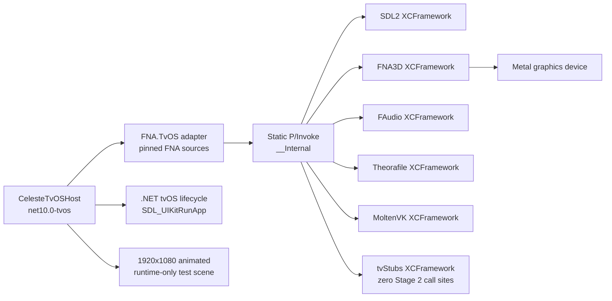

# Stage 2: modern .NET tvOS FNA host

## Outcome

**Stage 2 passes all required implementation, build, signing, installation,
and runtime gates.** The repository implementation, native-input validation,
simulator Debug/Release builds, trimmed Release runtime test, full-AOT device
publish, development signing, physical installation, first launch,
60-second heartbeat, background/foreground cycle, and clean second launch all
pass. Provisioning used the primary personal development team explicitly
authorised for this host; no alternate-store identity was used.

This stage does **not** show that Celeste builds, starts, or renders. The host
contains a generated geometric test scene only. It uses no Celeste executable,
decompiled source, game content, or FMOD material.

| State | Commit |
| --- | --- |
| Starting commit | `5c59ba1b2cb353d241f6026caa8da1d8e1822e24` |
| Stage 2 implementation commit | this report's commit |
| Branch | `tvos-port` |

The starting worktree was clean after an unrelated untracked Finder metadata
file was preserved outside the worktree. Generated apps, logs, screenshots,
profiles, native binaries, package caches, and local signing values remain in
ignored directories and are not part of the Stage 2 commit.

## Verified toolchain

| Item | Verified value |
| --- | --- |
| Host architecture | Apple Silicon arm64 |
| .NET SDK selected by `global.json` | `10.0.302` |
| SDK roll-forward | `latestPatch` (same feature band only) |
| Workload set | `10.0.302.0` |
| tvOS workload manifest | `26.5.10301/10.0.100` |
| Apple .NET pack | `Microsoft.tvOS.Sdk.net10.0_26.5` `26.5.10301` |
| Runtime observed in simulator | `.NET 10.0.10`, arm64 |
| Xcode | `26.6` (`17F113`) |
| tvOS device/simulator SDK | `26.5` / `26.5` |
| Deployment baseline | tvOS `16.0` |
| Physical target visibility | paired and connected, `AppleTV14,1` |

No SDK, workload, Xcode component, Homebrew package, or native dependency was
installed or updated. NuGet restore obtained the SDK-required ILLink task
package. A sandboxed restore could not reach the existing NuGet source and
reported `NU1301`; the normal host restore then succeeded. Later offline
restore/build invocations retained non-fatal `NU1900` vulnerability-feed
warnings because the feed was unavailable.

## Project architecture



The new projects are isolated below `tvos/`:

- `tvos/CelesteTvOSHost` is an SDK-style `net10.0-tvos` executable with a
  separate development bundle identifier, tvOS-only plist, empty entitlements,
  and privacy manifest.
- `tvos/FNA.TvOS` compiles the pinned FNA revision
  `d52b4ce61e4086b785c51a96d331dbf106975a58` as a repository-owned adapter.
  It links source files from the submodule without modifying the submodule.
- `tvos/Local.Build.props.example` documents private local signing inputs. Its
  `tvos/Local.Build.props` copy is ignored.
- `scripts/prepare-tvos-host-native.sh` validates and stages accepted native
  inputs into `.build/tvos-host`, an ignored directory.
- `scripts/verify-tvos-host.sh` verifies toolchain, native inputs, import
  mapping, bundle platform/architecture, private-data isolation, Stage 1
  isolation, and the existing iOS lane.
- `scripts/run-tvos-host-simulator.sh` performs the 60-second simulator runtime
  and lifecycle test without erasing or creating a simulator.

`celestemeow/celestemeow.csproj`, `build.sh`, the Xamarin/Mono path, and the
native-builder submodule are unchanged.

## FNA integration and compatibility changes

The first attempted approach was to consume FNA's existing target directly.
The pinned project is a legacy library and does not provide a modern Apple
target. The selected approach is the second allowed route: a small SDK-style
adapter includes the exact pinned FNA sources, stages the four pinned native
binding files, and applies two reviewable patches outside the submodule.

| Change | Original failure | Scope and rationale |
| --- | --- | --- |
| Adapter target pinned to `net10.0-tvos26.5` | A bare library target evaluated against the default tvOS 26.0 compatibility pack, whose reference/runtime packs are not installed | Selects the installed 26.5 Apple workload without changing the host's required `net10.0-tvos` declaration |
| Native import names changed to `__Internal` in staged bindings | Pinned bindings name `SDL2`, `FNA3D`, `FAudio`, and `Theorafile`, but device AOT statically links them into the executable | Compile-time mapping; no legacy Mono dllmap and no runtime dynamic libraries |
| FNA `MediaPlayer` alias renamed to `FNAMediaPlayer` in one staged file | `CS0576`: the alias conflicts with the modern global Apple `MediaPlayer` namespace | Identifier-only disambiguation; runtime behavior is unchanged |
| Pinned `XamarinHelper.cs` excluded | It defines a compatibility callback attribute rather than the modern Apple runtime attribute | Uses `ObjCRuntime.MonoPInvokeCallbackAttribute` for callbacks preserved by device AOT |
| Multi-RID project property removed | Device publish linked `libSystem.Globalization.Native.dylib` for tvOS into a target misclassified as tvOS Simulator | Apple SDK `_SdkIsSimulator` becomes true if *any* value in `RuntimeIdentifiers` contains `simulator`; explicit command-line RIDs now select each lane correctly |

No FNA upgrade, broad source fork, interpreter, reflection-based startup,
blanket linker descriptor, or broad warning suppression was added.

## Native inputs and references

Stage 1 `rebuild-e` and `rebuild-f` were reused; no native library was rebuilt.
The Stage 1 verifier was rerun once against `rebuild-e` and compared with
`rebuild-f`. It passed with the accepted logical SHA-256:

`61c1d97b7a585144b2b60ec0ed46f2d70f1f6239ec1732a17cc3101c3293fe39`

All six XCFrameworks are `NativeReference` items with static linkage,
`ForceLoad=true`, and `SmartLink=false`. MoltenVK is marked as C++. The
exhaustive Stage 1 framework set was retained:

`Foundation UIKit AVFoundation AudioToolbox CoreBluetooth CoreGraphics CoreHaptics GameController IOSurface Metal OpenGLES QuartzCore libc++`

`libc++` is selected by C++ linkage metadata rather than copied from the old
Xamarin linker arguments. No framework was removed merely because this test
scene does not reach all of its symbols.

Representative executable exports verified in both arm64 simulator and arm64
device outputs are:

- `_SDL_GetVersion`
- `_FNA3D_LinkedVersion`
- `_FAudioLinkedVersion`
- `_tf_fopen`
- `_vkGetInstanceProcAddr`

The self-test calls each implementation through `__Internal`. Theorafile is
tested with an intentionally missing in-memory-free file sentinel and returns
`TF_ENODATASOURCE`; no content is loaded. SDL reports pinned binding version
2.0.14 and native version 2.25.0. The major-2 ABI relationship is accepted and
logged rather than incorrectly requiring exact version equality.

The Stage 1 manifest declares 25 tvStubs exports. Source audit finds zero Stage
2 call sites for all 25. Runtime evidence logs `tvStubs call sites=0`; no stub
invocation was observed. Stage 3 should retain an explicit stub-call audit
because the broader managed game path may reach platform-only declarations.

## Lifecycle and rendering

`Main` enters `SDL_UIKitRunApp`. A static rooted `SDL_main_func` delegate and
the modern `MonoPInvokeCallback` annotation preserve the native callback under
AOT. The callback constructs the FNA `Game` directly; it does not use
reflection.

The test game:

- requests a 1920×1080, full-screen, vsync graphics device;
- forces and logs the FNA3D Metal renderer;
- creates a 1×1 white texture at runtime;
- clears to a deterministic time-varying colour;
- draws a moving, pulsing yellow rectangle and a white reference bar;
- logs a frame heartbeat every five seconds;
- uses no content pipeline, FMOD, networking, persistence, or required input.

Launch, active, resign-active, background, foreground, termination when
observable, FNA activation/deactivation, graphics creation/reset, and disposal
events are logged.

## Simulator results — verified

An installed tvOS 26.5 Apple TV 4K (3rd generation) arm64 simulator was used.
Its UUID is intentionally omitted.

| Gate | Result |
| --- | --- |
| Debug arm64 build | PASS |
| Release arm64 build with full trimming | PASS |
| Bundle executable | arm64, `TVOSSIMULATOR`, minimum 16.0, SDK 26.5 |
| Native interop self-test | PASS for SDL2, FNA3D, FAudio, Theorafile, MoltenVK |
| Renderer | FNA3D Metal |
| Graphics device | 1920×1080, Reach profile |
| Sustained render | PASS, 15 heartbeats through 75 seconds |
| Background/foreground | PASS; resign, background, foreground, active, and post-resume heartbeats observed |
| Stub use | zero observed |
| Managed/native failures | none observed |

The final ignored evidence directory is
`artifacts/tvos-host/simulator-final-pass/`:

| Evidence | SHA-256 |
| --- | --- |
| `fna-scene-before-background.png` | `fb427da17f258c33ca920000683a20a0388073e22fb2238b820c7bd9d799e895` |
| `fna-scene-after-foreground.png` | `de217d0f0ee50390b53653ff9e68f10a6d1b8c0e823852cc1dda92cb5f6b572d` |

The differing screenshots plus the frame counter/heartbeat progression show
that the output is animated rather than a static launch image. The console log
is ignored and not committed.

Two focused runtime corrections preceded the passing run:

- The first Theorafile sentinel test called `tf_close` on storage whose native
  open had failed; the pinned binding allocates that storage before the call.
  The test now frees the failed sentinel storage without asking native code to
  inspect it.
- The first automated acceptance script treated the successful text
  `tvStubs call sites=0` as a stub failure. The detector now matches only an
  explicit invocation/call-detected message.

## Device AOT and signing — verified

An initial unsigned command completed full arm64 device AOT with
`UseInterpreter=false`:

```bash
dotnet publish tvos/CelesteTvOSHost/CelesteTvOSHost.csproj \
  -c Release -r tvos-arm64 --no-restore -m:1 -nr:false \
  -p:EnableCodeSigning=false
```

The resulting executable is arm64 Mach-O with `LC_BUILD_VERSION` platform
`TVOS`, minimum 16.0, SDK 26.5, and all representative native exports listed
above. A subsequent signed Release publish used the same normal full-AOT lane,
with neither an interpreter nor an AOT/trimming bypass.

Xcode automatic provisioning was then run with the primary personal
development team. The Apple TV was already registered to that team: Xcode
reported one provisioned device before and after profile refresh and did not
report a new device-registration operation. Automatic provisioning created a
new unique development application identifier and a matching tvOS development
profile for this host. It selected the primary personal Apple Development
certificate. The alternate-store identity was not selected.

The signed output passed all of these checks:

- `codesign --display --verbose=4` reports a non-ad-hoc CMS signature with a
  code-directory hash, Team identifier, and the selected primary personal
  development leaf certificate;
- embedded profile platform `tvOS`, exact application match, one provisioned
  device, development-only `get-task-allow=true`, and no all-device or
  distribution property;
- signed certificate matched the profile's development certificate and the
  selected primary personal identity;
- basic certificate-chain validation of the development leaf through Apple's
  installed intermediate succeeds;
- no User Management entitlement;
- exactly one packaged Mach-O executable, arm64 `TVOS`, minimum 16.0, SDK
  26.5; and
- repository-owned bundle/native verification, including all representative
  exports and no iOS or simulator slice; and
- tvOS accepted the signed bundle, installed it, and launched it repeatedly.

On this Mac, `codesign --verify --deep --strict` returns
`CSSMERR_TP_NOT_TRUSTED`. Its macOS code-signing trust policy does not treat the
mobile-development leaf as a trusted Mac application identity. No code-hash,
resource-seal, profile, entitlement, or certificate-match error is reported.
The Apple-signed mobile profile plus successful tvOS installation and launch
are the authoritative platform validation. This host-policy result is retained
as a warning rather than incorrectly reported as a successful command.

Team ID, Apple account, identity fingerprint, profile UUID, device identifier,
device name, and private bundle identifier are intentionally omitted. They
exist only in ignored local configuration or ignored evidence. The generated
profile expires on 2026-08-09 and is suitable only for this personal
development host.

## Physical Apple TV results — verified

The signed app installed on the paired `AppleTV14,1`. Its first console-attached
launch reached managed startup, entered `SDL_UIKitRunApp`, passed every native
self-test, selected FNA3D Metal on the Apple A15 GPU, created a 1920x1080 Reach
graphics device, and emitted heartbeats through 165 seconds.

The host was backgrounded by launching the system Settings application and was
then foregrounded again. Logs show resign-active, FNA deactivation, background,
foreground, active, FNA activation, and nine subsequent frame heartbeats. The
process was terminated cleanly afterward.

The first diagnostic relaunches from Settings immediately entered the
background because Settings remained foreground. These were rejected as
acceptance evidence. After activating the Apple TV home shell, a clean launch
started a new process, repeated the native self-test and Metal graphics-device
initialisation, became active, and produced seven heartbeats through 35
seconds. That process was then terminated. This is the required clean second
launch.

Direct physical screenshot capture was attempted while a further live run was
rendering. `devicectl` and `xcdevice` expose no screenshot command for this
paired target, and Xcode's Devices window offered “Take Screenshot” but did not
produce a retrievable file. The equivalent physical visual/rendering evidence
is the device-only Metal log (`Apple A15 GPU`), 1920x1080 graphics-device
creation, active lifecycle, and continuously increasing frame/elapsed-time
heartbeats through 55 seconds during that attempt. No physical screenshot is
claimed or committed. The final screenshot-attempt process was explicitly
terminated.

Private local signing values are stored only in ignored
`tvos/Local.Build.props`, using `tvos/Local.Build.props.example` as the tracked
shape. No User Management entitlement was requested.

## Warnings and inferred risks

### Verified warnings

- The pinned FNA source emits trim warnings around content reader reflection,
  reflective vertex declaration creation, and `AssemblyTitleAttribute`.
  This Stage 2 scene uses no content and runs successfully in trimmed Release.
- The pinned FNA/SDL managed binding is 2.0.14 while the locked native SDL is
  2.25.0. The compatible major version is verified and the skew is logged.
- Offline NuGet vulnerability-feed access can emit `NU1900`; compilation is
  unaffected.
- Host-side `codesign --verify --deep --strict` returns
  `CSSMERR_TP_NOT_TRUSTED` for the mobile development leaf. Signature/profile
  matching, basic chain validation, and tvOS install/launch pass as described
  above.

### Failed attempts retained as diagnostic evidence

- The signing identity display name includes a parenthesised identifier that
  is not the provisioning Team ID. Using it as a team selector produced
  `No Account for Team`. The correct primary personal team was instead derived
  by matching the installed primary certificate to an existing development
  profile, then confirmed in Xcode's account UI.
- The minimal Xcode provisioning helper successfully created the profile and
  then failed its intentionally irrelevant UIKit link because it contained no
  `UIApplicationMain`. The profile result was independently decoded and
  verified; no helper binary is used by the host.
- The first signed publish retained the tracked plist's development bundle ID,
  so it did not match the private profile. Removing that hardcoded plist key
  allows the ignored `ApplicationId` property to supply the signed bundle ID.
- Relaunching while Settings was foreground immediately backgrounded the host.
  Those runs were discarded; the acceptance relaunch began from the Apple TV
  home shell and remained active.

### Inferred Stage 3 risks

- Celeste's decompiled/generated assembly will require a separate managed
  retarget analysis; Stage 2 intentionally does not reference it.
- Celeste content readers and reflected types may need focused trim/AOT roots.
  The current FNA warnings identify likely areas but are not evidence that any
  particular game type fails.
- Stage 3 must verify that no new path reaches a tvStubs symbol.
- FNA's legacy SDL/FNA binding assumptions may reveal additional callbacks
  under the broader game path.
- FMOD remains entirely out of scope until Stage 5.

## Rebuild and verification commands

Prepare the accepted Stage 1 inputs without rebuilding them:

```bash
scripts/prepare-tvos-host-native.sh --clean
```

Build and exercise the simulator:

```bash
dotnet restore tvos/CelesteTvOSHost/CelesteTvOSHost.csproj \
  -r tvossimulator-arm64 --packages .build/tvos-dotnet/nuget
dotnet build tvos/CelesteTvOSHost/CelesteTvOSHost.csproj \
  -c Debug -r tvossimulator-arm64 --no-restore
dotnet build tvos/CelesteTvOSHost/CelesteTvOSHost.csproj \
  -c Release -r tvossimulator-arm64 --no-restore
scripts/run-tvos-host-simulator.sh \
  --app tvos/CelesteTvOSHost/bin/Release/net10.0-tvos/tvossimulator-arm64/CelesteTvOSHost.app \
  --duration 60
```

Build the unsigned device AOT gate:

```bash
dotnet restore tvos/CelesteTvOSHost/CelesteTvOSHost.csproj \
  -r tvos-arm64 --packages .build/tvos-dotnet/nuget \
  -p:EnableCodeSigning=false
dotnet publish tvos/CelesteTvOSHost/CelesteTvOSHost.csproj \
  -c Release -r tvos-arm64 --no-restore \
  -p:EnableCodeSigning=false
scripts/verify-tvos-host.sh \
  --app tvos/CelesteTvOSHost/bin/Release/net10.0-tvos/tvos-arm64/CelesteTvOSHost.app \
  --platform tvos
```

For a future authorised local device run, configure the ignored local props
with placeholders replaced locally, publish, and discover the device
identifier dynamically:

```bash
cp tvos/Local.Build.props.example tvos/Local.Build.props
# Edit only the ignored copy: <TEAM_ID>, <BUNDLE_ID>, and
# <PROVISIONING_PROFILE_NAME_OR_UUID> remain local.

dotnet publish tvos/CelesteTvOSHost/CelesteTvOSHost.csproj \
  -c Release -r tvos-arm64 --no-restore

TVOS_DEVICE_ID='<DEVICE_ID>'
xcrun devicectl device install app --device "$TVOS_DEVICE_ID" \
  tvos/CelesteTvOSHost/bin/Release/net10.0-tvos/tvos-arm64/CelesteTvOSHost.app
xcrun devicectl device process launch --device "$TVOS_DEVICE_ID" \
  --console --timeout 75 <BUNDLE_ID>
```

`$TVOS_DEVICE_ID`, signing identity, account, Team ID, profile, and the final
bundle identifier must never be copied into a tracked file or report.

## Acceptance status

| Stage 2 criterion | Status |
| --- | --- |
| SDK 10.0.302 / workload set 10.0.302.0 | PASS |
| Existing iOS lane unchanged | PASS |
| Six accepted Stage 1 XCFrameworks reused | PASS |
| Simulator arm64 Debug and Release builds | PASS |
| Animated FNA/Metal scene for at least 60 seconds | PASS |
| Simulator native self-tests and no tvStubs calls | PASS |
| Simulator background/foreground | PASS |
| Device arm64 full AOT build | PASS, unsigned preliminary and signed final publish |
| Development signing | PASS, primary personal team and development identity |
| Physical install and first launch | PASS |
| Physical renderer/native self-test | PASS, Metal on Apple A15 GPU; all imports; zero tvStubs calls |
| Physical 60-second heartbeat | PASS, continued through 165 seconds |
| Physical background/foreground | PASS, nine post-resume heartbeats |
| Physical second launch | PASS, clean new process with seven active heartbeats |
| Physical visual evidence | PASS by equivalent device-only render evidence; direct screenshot unavailable |
| No Celeste/FMOD/private material committed | PASS |

Every mandatory Stage 2 criterion passes. This proves only the modern tvOS
application, static native interop, SDL, FNA, Metal graphics, device AOT, and
development deployment foundation. It does not show that Celeste builds,
starts, or renders.
