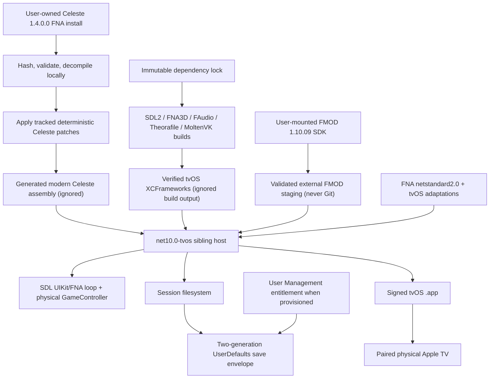

# Celeste tvOS Port Audit and Implementation Plan

Audit date: 2026-08-01 (Europe/London)
Repository: `RoootTheFox/celeste-ios`
Audit worktree: `$REPO_ROOT` (repository: `celeste-ios-tvos`)
Scope: audit and implementation plan only; this report does **not** claim that Celeste runs on tvOS.

## Evidence labels

- **VERIFIED** — observed in this worktree, a pinned upstream revision, the mounted FMOD SDK, a read-only disassembly of the user's Celeste 1.4.0.0 binary, or a command executed during this audit.
- **INFERRED RISK** — a technically likely outcome which has not yet been demonstrated by the staged port.
- **UNVERIFIED REQUIREMENT** — depends on a user-owned input, signing account/capability, physical-device test, or a future build.

## Executive feasibility conclusion

**Feasible, but not yet demonstrated.** The repository already contains meaningful tvOS groundwork: a `__TVOS__` launcher branch, device/simulator native build branches, an Apple TV stub archive target, and pinned native projects that still expose tvOS targets. That is enough to justify an incremental port. It is not enough to say the game builds or runs: the current top-level build is iOS-only, its checked-in native archives are iOS objects, three tvOS builder commands select the wrong native targets, the current project is an iOS Xamarin project, and no tvOS package has been signed or launched.

The recommended production route is **Route B: a separate SDK-style `net10.0-tvos` host**, leaving the existing iOS project and iOS build lane intact. This host/Xcode combination is supported by Microsoft's current .NET 10 Apple workload, but that SDK/workload is not installed. The exact supported combination for Xcode 26.6 is .NET SDK 10.0.302 with workload set 10.0.302.0 ([official `dotnet/macios` release](https://github.com/dotnet/macios/releases/tag/dotnet-10.0.1xx-xcode26.6-10301)). Installation is a later, explicit user action.

Route A remains a useful contingency. A clean-room Xamarin.tvOS probe in `/tmp` successfully compiled and linked both an x86_64 tvOS simulator app and an AOT-compiled arm64 tvOS device app with the installed Xcode 26.6 SDK. It was unsigned and was not launched. Xamarin 16.4 identifies itself as an Xcode 14.3-era toolchain, so a successful minimal build does not remove its support, binding-age, linker, or physical-device risks.

The work must remain split into the requested stages. In particular, native libraries, an empty SDL/FNA host, Celeste managed-code loading, controller behavior, FMOD, durable saving, Apple TV user isolation, and final signing must each have separate acceptance gates.

## Scope and guardrails

The audit and diagnostic probes did not install software, initialize nested submodules, alter existing tracked files, download commercial content, copy Celeste or FMOD binaries into Git, push, or create a pull request. Stage 0 closeout commits only this report and `scripts/diagnose-tvos-host.sh`; it does not begin Stage 1.

The eventual implementation must preserve these rules:

1. The current iOS project remains a separate supported lane.
2. Celeste game files and generated/decompiled sources stay local and ignored; only deterministic tooling and patches are versioned.
3. FMOD archives stay outside Git and are staged from a user-mounted licensed SDK.
4. Dependency revisions are locked to immutable commits/tags; moving `21.03` branches are not reproducible inputs.
5. Device and simulator artifacts are never mixed merely because both contain an arm64 slice; the Mach-O platform must be checked.
6. No stage advances until its acceptance criteria pass.

## Exact starting state

The following was recorded before creating either audit artifact.

| Item | Starting value |
|---|---|
| Commit | `477195920e29ceac66a01f026525ddf3c78f21ba` |
| Branch | `tvos-port` |
| Worktree | clean; `git status --short` produced no paths |
| Origin | `https://github.com/RoootTheFox/celeste-ios.git` |
| FNA submodule | `d52b4ce61e4086b785c51a96d331dbf106975a58` (`21.03.05`), detached and clean |
| Native builder submodule | `41e34f66f8e74181d13e3a6e372d5085e3e1a344` (`heads/celeste`), detached and clean |
| `FNA/lib/FAudio` gitlink | `0e39055a3fb3c27de8dc02d650fe6a3da6c4de2c`, uninitialised (`-`) |
| `FNA/lib/FNA3D` gitlink | `dba98a71514cc30f3c19dc19fc0a479be7c90d52`, uninitialised (`-`) |
| `FNA/lib/SDL2-CS` gitlink | `2b8d237fd4585d14ea837764ac247d4cd200158f`, uninitialised (`-`) |
| `FNA/lib/Theorafile` gitlink | `0c5504658a3108919e53b625287786a87529de42`, uninitialised (`-`) |

`git submodule foreach --recursive` reported only the two initialized top-level submodules, both detached and clean. The leading `-` entries above are gitlink state, not modified content.

## Repository architecture and evidence

### Current top-level build

**VERIFIED:** `build.sh` is an interactive, iOS-only orchestration script:

1. It validates a user-supplied, unmodified, FNA-based Celeste installation and expects `Celeste.exe`, `FNA.dll`, `System.Xml.dll`, `System.Core.dll`, and `Content/`. It explicitly rejects common Everest files.
2. It requires FMOD Engine 1.10.09 and currently copies only `libfmod_iphoneos.a` and `libfmodstudio_iphoneos.a` into `celestemeow/`.
3. It installs `ilspycmd` 8 preview if missing. This is convenient, but an implicit mutable tool installation is not a reproducible build step.
4. It initializes only the top-level submodules, then manually clones FNA's nested dependencies because the historical nested URLs fail. Some clones use moving branches (`FNA3D` `21.03`, `FAudio` `21.03.05`) instead of immutable SHAs.
5. It applies the FNA DLL-map and renderer patches, copies the user's game into ignored `_celeste_game/`, decompiles to ignored `_celeste_decomp/`, applies Steam-removal/crash patches, and runs `dotnet publish --configuration Release`.
6. The generated/decompiled project outputs `net452`. The script renames `_celeste_decomp/bin/Release/net452/Celeste.exe` to `celeste/Celeste.dll`, copies the game-provided `mscorlib.dll`, `Celeste.Content.dll`, content tree, and `Celeste.dll.config`.
7. It updates native sources, optionally applies the iOS `GCVirtualController` patch, runs only `./buildlibs.sh ios`, and copies only `release/ios/device/`.
8. It invokes the legacy project as `Release|iPhone` with signing disabled, moves an `.ipa`, and describes the output as iOS.

There is no top-level tvOS build lane, target selection, tvOS FMOD staging, tvOS project invocation, or tvOS package path.

### Managed projects and launcher

**VERIFIED:** `celestemeow/celestemeow.csproj` is a legacy MSBuild/Xamarin.iOS application project (`ToolsVersion="4.0"`) importing `Xamarin/iOS/Xamarin.iOS.CSharp.targets` and referencing `Xamarin.iOS`. It defines only the `iPhone` device configurations; simulator groups are commented out. It references generated `celeste/Celeste.dll` and the FNA project.

**VERIFIED:** FNA is revision/tag `21.03.05`; its assembly version is `21.03.05.0`. `FNA.Core.csproj` is SDK-style but is a library targeting `net40;netstandard2.0`. It compiles the SDL2-CS, FAudio C# and Theorafile C# bindings directly and P/Invokes FNA3D.

**VERIFIED:** `celestemeow/Main.cs` has the preprocessor branch `#if __IOS__ || __TVOS__`. On either platform it:

- enables high-DPI rendering;
- disables mouse/touch synthesis;
- sets `FNA3D_FORCE_DRIVER=Metal`;
- calls `SDL_UIKitRunApp`;
- uses `MonoPInvokeCallback` on the native callback; and
- reflects the non-public static `Celeste.Celeste.Main` method and invokes it.

This is genuine launcher groundwork, but reflection and callback preservation become AOT/linker obligations.

### Native integration and linker flags

**VERIFIED:** FNA's `app.config` and the app/Celeste config files map SDL2, FNA3D, FAudio, Theorafile and FMOD names to `__Internal`, expecting all native code to be statically linked into the main executable.

The iOS Xamarin project uses one long `MtouchExtraArgs` link command. Debug force-loads SDL2, FNA3D, Theorafile, MoltenVK and FMOD. Release force-loads SDL2, FNA3D, MoltenVK and FMOD but omits FAudio and Theorafile despite the managed bindings. It links a broad iOS framework list and sets `MtouchLink=SdkOnly`, `MtouchInterpreter=-all`, and symbol stripping off. Those settings must not be copied wholesale into a modern tvOS target.

**VERIFIED:** all five archives in `fnalibs-ios-builder-celeste/prebuilt/` are arm64 **iPhoneOS** objects, not tvOS objects:

| Archive | Mach-O platform | Minimum | SDK recorded |
|---|---:|---:|---:|
| `libFAudio.a` | iPhoneOS | 11.0 | 16.1 |
| `libFNA3D.a` | iPhoneOS | 11.0 | 16.1 |
| `libMoltenVK.a` | iPhoneOS | 9.0 | 16.1 |
| `libSDL2.a` | iPhoneOS | 9.0 | 16.1 |
| `libtheorafile.a` | iPhoneOS | 11.0 | 16.1 |

An architecture-only `lipo` check is insufficient; Stage 1 must also assert `TVOS` or `TVOSSIMULATOR` load commands.

### Info.plist, assets, entitlements, packaging and signing

**VERIFIED:** the current `Info.plist`, icon catalog and launch resources are iOS resources. `Entitlements.plist` requests extended virtual addressing, increased memory, and DriverKit communication; it does not request tvOS user management. The project uses iOS automatic provisioning metadata but `build.sh` disables signing and produces an iOS `.ipa`.

The eventual tvOS target needs its own bundle identifier, `UIDeviceFamily` 3, tvOS app icon/top-shelf assets, deployment target, privacy manifest, entitlements, signing settings and `.app` packaging. None of that should be introduced by mutating the existing iOS target.

## Existing tvOS support: complete inventory

### Repository-controlled branches, symbols, commands and stubs

| Location | Existing tvOS behavior | Assessment |
|---|---|---|
| `celestemeow/Main.cs` | `__TVOS__` shares the SDL UIKit launcher path with `__IOS__` | Real and reusable; currently no tvOS project defines it |
| `buildlibs.sh` argument parser | accepts `tvos`, `tvos-sim`, and `all`; creates `release/tvos/device` and `release/tvos/simulator` | Real |
| SDL commands | target `Static Library-tvOS`, SDKs `appletvos`/`appletvsimulator`, `SDL_MAIN_HANDLED=1` | Target exists at the exact SDL revision |
| FNA3D commands | target `FNA3D` for both tvOS SDKs | **Wrong target name at the audited pinned revision; use `FNA3D-tv`** |
| FAudio commands | target `FAudio` for both tvOS SDKs | **Wrong target name; use `FAudio-tv`** |
| Theorafile commands | target `theorafile` for both tvOS SDKs | **Wrong target name; use `theorafile-tv`** |
| `tvStubs` commands | target `tvStubs` for both tvOS SDKs | Target exists; project has `SDKROOT=appletvos`, deployment target 15.0 |
| MoltenVK commands | `fetchDependencies --tvos/--tvossim`, `make tvos/tvossim`, copies tvOS XCFramework slices | Supported by MoltenVK v1.2.9, but old output paths need validation under Xcode 26 |
| SDL upstream source | `TARGET_OS_TV`, `__APPLETV_OS_VERSION_MAX_ALLOWED`, tvOS remote/controller logic | Present at pinned SDL revision |
| FNA native config | `FNA3D_DRIVER_VULKAN`, `FNA3D_DRIVER_OPENGL`; launcher forces `Metal` | Renderer intent needs a Stage 2 proof; MoltenVK may be linked even when the forced runtime driver is Metal |

The shell switches are `TVOS` and `TVOS_SIM`. For each selected switch, the script invokes the same target with `-sdk appletvos` or `-sdk appletvsimulator` and copies respectively to `release/tvos/device` or `release/tvos/simulator`: SDL `Static Library-tvOS`, FNA3D `FNA3D` (must become `FNA3D-tv`), FAudio `FAudio` (must become `FAudio-tv`), Theorafile `theorafile` (must become `theorafile-tv`), and `tvStubs`. MoltenVK instead runs `fetchDependencies --tvos` + `make tvos` or `--tvossim` + `make tvossim` and selects the corresponding XCFramework library. These are all tvOS native command branches present in the audited repository.

The relevant compile-time/platform symbols are `__TVOS__` in the C# launcher; `TARGET_OS_TV` and `__APPLETV_OS_VERSION_MAX_ALLOWED` in pinned SDL Apple code; `SDL_MAIN_HANDLED=1` on the SDL tvOS builds; and the shell selection variables `TVOS`/`TVOS_SIM`. `__IOS__`, `TARGET_OS_IOS`, `FNA3D_DRIVER_OPENGL` and `FNA3D_DRIVER_VULKAN` are adjacent conditions but must not be mistaken for tvOS target proof.

`tvStubs/stubs.c` exports 25 no-op platform symbols so Xamarin's static registrar/linker does not reject bindings for platforms unavailable on tvOS: `SDL_SetWindowsMessageHook`, `SDL_Direct3D9GetAdapterIndex`, `SDL_RenderGetD3D9Device`, `SDL_DXGIGetOutputInfo`, `SDL_LinuxSetThreadPriority`, `SDL_AndroidGetJNIEnv`, `SDL_AndroidGetActivity`, `SDL_GetAndroidSDKVersion`, `SDL_IsAndroidTV`, `SDL_IsChromebook`, `SDL_IsDeXMode`, `SDL_AndroidBackButton`, `SDL_AndroidGetInternalStoragePath`, `SDL_AndroidGetExternalStorageState`, `INTERNAL_SDL_AndroidGetExternalStoragePath`, `SDL_AndroidGetExternalStoragePath`, `SDL_WinRTGetFSPathUNICODE`, `SDL_WinRTGetFSPathUTF8`, `SDL_WinRTGetDeviceFamily`, `SDL_WinRTRunApp`, `SDL_AndroidRequestPermission`, `SDL_RenderGetD3D11Device`, `SDL_AndroidShowToast`, `emscripten_set_main_loop`, and `emscripten_cancel_main_loop`. These stubs are a compatibility workaround, not evidence that their features work.

### Pinned native targets

The source directories have not been downloaded in this clone, so this audit checked the immutable upstream revisions referenced by the repository rather than running their builds.

| Component | Audited revision | tvOS target/path verified upstream | Current command correct? |
|---|---|---|---|
| SDL2 | `257cacab183b312bbe60bd7967eee44a3ad7be85` from `updatelibs.sh` | `Xcode/SDL/SDL.xcodeproj`, `Static Library-tvOS`, device and simulator SDK support | Yes |
| FNA3D | `dba98a71514cc30f3c19dc19fc0a479be7c90d52` FNA gitlink | `Xcode-iOS/FNA3D.xcodeproj`, `FNA3D-tv` | No |
| FAudio | `0e39055a3fb3c27de8dc02d650fe6a3da6c4de2c` FNA gitlink | `Xcode-iOS/FAudio.xcodeproj`, `FAudio-tv` | No |
| Theorafile | `0c5504658a3108919e53b625287786a87529de42` | `Xcode-iOS/theorafile.xcodeproj`, `theorafile-tv` | No |
| MoltenVK | tag `v1.2.9` | Make targets `tvos`, `tvossim`; dependency flags `--tvos`, `--tvossim` | Conceptually yes |
| tvStubs | builder commit `41e34f6…` | local `tvStubs` static-library target | Yes |

**VERIFIED:** all five real native components can theoretically produce `appletvos` and `appletvsimulator` libraries at their historical revisions. **UNVERIFIED:** they have not been compiled with Xcode 26.6 in this worktree. Old project references, deployment targets, warning-as-error behavior, removed compiler flags, generated output paths and Apple Silicon simulator architectures may need small, reviewable patches.

**Reproducibility defect:** `updatelibs.sh` pins SDL, Theorafile, MojoShader, Vulkan-Headers and MoltenVK, but clones FNA3D and FAudio from moving branch names. Stage 1 must introduce a lock manifest with exact commits and verify each checkout before building.

## Pull request #21 save-path audit

No `refs/pull/21/*` ref was available locally, so the supplied URL was inspected through the connected GitHub service. **VERIFIED:** [PR #21](https://github.com/RoootTheFox/celeste-ios/pull/21) is open and unmerged at audit time. Its base is this audit's starting commit. It adds an SDL save-path patch and iOS file-sharing plist changes. The SDL patch selects `NSDocumentDirectory` only when `!TARGET_OS_TV`; the tvOS branch deliberately remains `NSCachesDirectory` and warns that it is non-persistent. Review discussion also identifies the lack of migration for existing iOS saves.

Therefore PR #21 must **not** be copied as the tvOS solution. It is useful evidence that the author intentionally avoided Documents on tvOS, but a cache directory alone cannot satisfy durable saves.

## Host and toolchain report

### Host

| Item | Verified value |
|---|---|
| macOS | 26.3, build `25D5087f` |
| Kernel/architecture | Darwin 25.3.0, arm64, Apple M1 |
| Selected developer directory | `/Applications/Xcode.app/Contents/Developer` |
| Xcode | 26.6 (`17F113`) |
| iOS SDKs | device 26.5, simulator 26.5 |
| tvOS SDKs | device 26.5, simulator 26.5 |
| tvOS runtimes | 26.1 (`23J579`), 26.2 (`23K51`), 26.5 (`23L470`) |
| Apple TV simulators | nine available, covering Apple TV 4K 3rd generation 4K/1080p and Apple TV, all currently shut down |
| Paired physical target | Apple TV 4K 3rd generation (`AppleTV14,1`), available and paired |
| Signing identities | two valid Apple Development identities; profiles/capability suitability not verified |

The tvOS 26.5 SDK contains all frameworks currently listed by the iOS target except `CoreMotion`. Presence is not proof of need; Stage 1/2 should derive a minimal framework list from actual undefined symbols.

### .NET

- Installed SDKs: 6.0.425 and 7.0.317; active 7.0.317.
- Installed workloads: MAUI iOS, Mac Catalyst and Android 7.0.101. The `tvos` workload is discoverable but not installed.
- No Microsoft.tvOS reference/runtime packs are installed; manifest directories alone are not a workload installation.
- `net10.0-tvos` cannot build **in the current installed state**.
- **VERIFIED CURRENT REQUIREMENT:** Microsoft supports Xcode 26.6 with .NET SDK 10.0.302 and workload set 10.0.302.0. Installing those later makes Route B toolchain-compatible with this Xcode; it does not prove the game code is compatible.

### Mono/Xamarin

- Mono 6.12.0.188 reports amd64 and therefore runs under translation on this arm64 Mac.
- Mono MSBuild 16.10.1, xbuild 14.0, mcs and Roslyn csc are present.
- Xamarin.iOS.framework 16.4.0.23 is installed. Its bundle contains `Xamarin.TVOS.dll`, AppleTVOS/AppleTVSimulator SDK directories and `Xamarin.TVOS.CSharp.targets`; there is no need for a separate top-level Xamarin.tvOS framework.
- `mtouch` reports `16.4.0.23 (xcode14.3: 9defd91b3)`.
- A temporary minimal project built an x86_64 `TVOSSIMULATOR` executable and an AOT arm64 `TVOS` executable against SDK 26.5 using Xcode 26.6. No repository file was used or changed; neither app was signed, installed or launched.

### Native tools

Present: Apple clang 21.0.0, Apple `ar/libtool/lipo/otool/vtool`, GNU make 3.81, GNU make 4.4.1 (`gmake`), Python 3.9.6, Git 2.50.1, pkg-config 2.5.1, autoconf 2.72 and Homebrew 6.0.13.

Missing: CMake, Ninja, `python`, automake, Meson, NASM and Yasm. CMake is explicitly required by `updatelibs.sh`; Ninja is recommended for a deterministic modern build wrapper. Nothing was installed during this audit.

## Route A versus Route B

| Decision factor | Route A — Xamarin.tvOS sibling | Route B — SDK-style .NET tvOS |
|---|---|---|
| Installed-Xcode buildability | **Minimal compile/AOT verified** for simulator and unsigned arm64 device with Xcode 26.6. Xamarin labels itself Xcode 14.3-era; this combination is not a supported long-term baseline. | **Supported after manual install**, not buildable now. Use .NET 10.0.302 + tvOS workload set 10.0.302.0 for Xcode 26.6. |
| Project shape | New legacy sibling importing Xamarin `TVOS` targets and referencing `Xamarin.TVOS`. Existing iOS csproj stays untouched. | New sibling `Microsoft.NET.Sdk` executable targeting `net10.0-tvos`; existing iOS csproj stays untouched. |
| Generated Celeste assembly | Existing generated `net452` assembly and game-era BCL layout can be retained, as on iOS. | Do not rely on a direct `net452` binary reference. Regenerate and retarget the decompiled source to `net10.0-tvos` (or a compatible modern shared target) against modern BCL identities. Keep source generated/ignored and version only patches/tooling. |
| FNA | Reuse FNA `net40` output and current Mono DLL maps. | FNA already has `netstandard2.0`, but its 2021 interop/runtime assumptions need conditional adaptation and AOT tests. |
| AOT/reflection | Xamarin full AOT on device; current `MonoPInvokeCallback`, reflection entrypoint, XmlSerializer, generic instantiations and linked members need preservation. `MtouchInterpreter=-all` must not be treated as a production fix. | .NET tvOS device build is AOT/trimmed. Add source-generated or preserved serializers, explicit reflection dependencies, callback attributes and an AOT smoke suite. Avoid runtime code generation. |
| Native integration | Static `.a` files via `MtouchExtraArgs` or Xamarin `NativeReference`, with platform-correct archives and force-load only where proven necessary. | Prefer per-component XCFrameworks/`NativeReference` items with tvOS device and simulator slices. Preserve `__Internal` or use a controlled `DllImportResolver`; verify native symbols at publish time. |
| Signing | Xamarin/MSBuild `CodesignKey`, `CodesignProvision`, target-specific entitlements; provisioning capability still user-dependent. | `dotnet publish` with `CodesignKey`, `CodesignProvision`, `CodesignEntitlements`; same Apple certificate/profile/capability requirements. |
| Major risks | Obsolete Xamarin/Mono, old Apple bindings, Xcode 26 unsupported by the toolchain vintage, translated host tooling, uncertain future provisioning/device support. | Larger managed retarget, stricter AOT/trimming, 2021 FNA assumptions, changes to serialization/reflection and runtime behavior. |
| Expected repository change | Medium: sibling project, native lane, plist/assets/entitlements, bridge and build scripts. | High but compartmentalized: sibling project, deterministic managed regeneration/retarget, AOT descriptors or generated code, native XCFramework lane, bridge and build scripts. |
| Maintainability | Low; a bridge to an abandoned ecosystem. | Highest; current supported Apple/.NET workload, current Xcode support, clearer RID/native packaging. |
| Recommendation | Contingency/prototyping route only. | **Recommended.** |

### Recommendation rationale

Route B requires more repository work, but the work is already required by the highest-risk areas: deterministic managed regeneration, AOT-safe reflection/serialization, platform-correct native packages, lifecycle saves and entitlement-aware signing. Doing that work behind a modern sibling target avoids tying a new port to Xamarin 16.4 and an Xcode 14.3-era binding surface. The iOS project remains unchanged and can continue using its current toolchain.

If Stage 3's managed retarget proves disproportionately difficult, Route A is a bounded fallback experiment, not a reason to merge both approaches. Its first gate would be an unsigned Celeste-free device build with all native libraries, followed by a signed physical-device launch; failure at either gate returns to Route B.

## Recommended architecture



Recommended repository boundaries:

- retain `celestemeow/` and the existing `build.sh` as the iOS lane;
- create a sibling such as `celestemeow.tvos/` for the modern host;
- add noninteractive `scripts/fetch-tvos-deps.sh`, `scripts/build-tvos-native.sh`, `scripts/generate-celeste-tvos.sh` and `scripts/package-tvos.sh` in later stages;
- add a machine-readable dependency lock containing URL, commit/tag and expected SHA-256 where licensing permits;
- put all build/game/FM0D outputs under ignored staging directories, never source directories;
- keep tvOS-specific patches small and independently applicable.

## FMOD audit

### Managed API expected by Celeste

**VERIFIED:** read-only IL disassembly of the user's unmodified Celeste 1.4.0.0 `Celeste.exe` found embedded managed FMOD C# bindings and module references for `fmod`, `fmodstudio` and `fmod_SDL`. `FMOD.VERSION.number` is `0x00011014`. FMOD encodes the patch in a byte, so `0x14` is decimal 20: the binding/API version is **1.10.20**.

### Native archives currently used and tvOS archives present

**VERIFIED:** the current build script insists on FMOD 1.10.09 and copies exactly:

- `FMOD Programmers API/api/lowlevel/lib/libfmod_iphoneos.a` → `celestemeow/libfmod.a`
- `FMOD Programmers API/api/studio/lib/libfmodstudio_iphoneos.a` → `celestemeow/libfmodstudio.a`

The FMOD 1.10.09 iOS SDK was mounted during this audit. `doc/revision.txt` reports `1.10.09` build 97915 and `fmod_common.h` defines `FMOD_VERSION 0x00011009`. It contains these required tvOS release archives:

| SDK-relative path | Architecture(s) | Verified platform marker |
|---|---|---|
| `api/lowlevel/lib/libfmod_appletvos.a` | arm64 | `LC_VERSION_MIN_TVOS`, min 9.0 |
| `api/studio/lib/libfmodstudio_appletvos.a` | arm64 | `LC_VERSION_MIN_TVOS`, min 9.0 |
| `api/lowlevel/lib/libfmod_appletvsimulator.a` | i386, x86_64 | `LC_VERSION_MIN_TVOS`, min 9.0 |
| `api/studio/lib/libfmodstudio_appletvsimulator.a` | i386, x86_64 | `LC_VERSION_MIN_TVOS`, min 9.0 |

The simulator archives have no arm64 slice. On this Apple Silicon Mac, Stage 5 must either prove the `tvossimulator-x64` lane under Rosetta or keep simulator audio disabled; physical-device arm64 audio remains mandatory.

### Version constraint and Stage 5 rule

There is a real version skew: managed API 1.10.20 versus native libraries 1.10.09. FMOD states that 1.10 patch releases are binary-compatible with one another, but the actual Celeste initialization/version checks have not been executed on tvOS. The port must **not upgrade FMOD**. Stage 5 must:

1. accept an explicit `FMOD_SDK_ROOT` pointing to the mounted 1.10.09 SDK;
2. verify `revision.txt`, header version, archive names, architectures, Mach-O platform and required exported symbols;
3. stage the archives only in an ignored build directory;
4. log the native runtime version on device and fail clearly on `ERR_VERSION`/header mismatch;
5. test low-level and Studio initialization, bank loading, music/SFX, interruption, background/foreground and shutdown on the physical Apple TV.

If the SDK is not mounted in a future build environment, its paths, archives and license acceptance become **UNVERIFIED REQUIREMENTS** until the user mounts the exact 1.10.09 iOS SDK. This audit verified the current mount only; it did not copy any archive.

## Controller strategy

The first usable version requires a physical Bluetooth controller supported by Apple's GameController framework. The Siri Remote is not an acceptance input device.

**Do not apply `patches/SDL-gamecontroller.patch` to tvOS.** It creates `GCVirtualController`, is guarded only by `@available(iOS 15, *)`, and is an iOS touch-overlay feature. A deterministic native build should make the patch explicitly iOS-only rather than asking an interactive question.

### Existing SDL/FNA path

**VERIFIED:** FNA initializes SDL video, joystick, game-controller and haptic subsystems, optionally loads `gamecontrollerdb.txt`, forces physical button labels, drains initial controller-added events, and handles controller added/removed events thereafter. It maps SDL buttons and axes to XNA `GamePadState`, including A/B/X/Y, Start, Back, Guide, shoulders, sticks, triggers and D-pad.

At the pinned SDL revision, the Apple MFi backend has tvOS-specific handling:

- extended controllers expose a Start button;
- for MFi controllers whose Menu button would return to the tvOS home screen, SDL uses `controllerPausedHandler` and emits a synthetic Start press/release;
- other supported controllers can read `buttonMenu` directly;
- the Siri Remote micro-gamepad can be exposed as a joystick by default.

Before SDL initialization, the tvOS launcher should set `SDL_HINT_TV_REMOTE_AS_JOYSTICK=0` so the remote cannot take controller slot zero. Keep the physical controller requirement visible in the empty-host UI.

**VERIFIED from Celeste 1.4.0.0 IL:** default Celeste controller bindings include Start for Pause, A for Confirm, B/X for Cancel, A/Y for Jump, X/B for Dash, and left shoulder for Journal. Movement/menu navigation accepts sticks/D-pad through FNA. Settings can remap these bindings and therefore belong in the durable save set.

### Controller acceptance tests

- launch with controller already connected and with no controller;
- connect after launch and verify slot zero/capabilities/state;
- disconnect during gameplay and in menus, show a non-destructive reconnect prompt, then resume;
- reconnect the same controller and a different supported controller;
- verify A/B/X/Y labels versus physical layout and Celeste's remap screen;
- persist a remap across relaunch;
- verify D-pad, both sticks, triggers, shoulders and rumble where supported;
- verify the controller's Menu/Options/Pause behavior: one press pauses Celeste where SDL supplies Start, while the tvOS-reserved system action remains available as required by the platform;
- verify the Siri Remote never becomes gameplay controller zero;
- repeat after resign-active/background/foreground.

## Save-path audit and durable-save design

### What Celeste actually does

**VERIFIED from Celeste 1.4.0.0 IL:** `Celeste.UserIO.GetSavePath(dir)` has explicit Linux/BSD, macOS and Windows paths. Other platforms call `SDL_GetPrefPath(null, "Celeste")` and append `dir`. tvOS therefore reaches SDL's Cocoa preference-path implementation rather than a Celeste-specific tvOS path.

`UserIO` defines:

- `SavePath = GetSavePath("Saves")`;
- `BackupPath = GetSavePath("Backups")`;
- each handle as `<name>.celeste`;
- settings name `settings`;
- normal save slots `0`, `1`, `2`; slot 4 maps to `debug`.

Expected durable inventory:

- `Saves/0.celeste`, `Saves/1.celeste`, `Saves/2.celeste`;
- optional `Saves/debug.celeste`;
- `Saves/settings.celeste`;
- corresponding `Backups/*.celeste` files when those names have been saved.

`errorLog.txt` is placed at the SDL preference root but is diagnostic, not part of the durable save set.

Saves/settings are XML serialized with `XmlSerializer`. The save flow serializes in a coroutine, runs `SaveThread`, writes the new bytes to `Backups/<name>.celeste`, reloads that file to validate its XML, and only then copies it over `Saves/<name>.celeste`. Consequently Celeste's `Backups` directory contains a validation/staging copy of the new data, **not an independent previous generation**. The tvOS bridge must provide its own rollback generation.

### Proposed bridge

1. The tvOS host creates a normal per-session filesystem root below its cache container, with `Saves/` and `Backups/` directories.
2. Before calling `SDL_UIKitRunApp`/Celeste, it restores the newest valid durable generation to that root and sets a tvOS-only path override. A small tracked SDL Cocoa patch should make `SDL_GetPrefPath` honor that host-provided session root only under `TARGET_OS_TV`; this is not PR #21's Documents/cache switch.
3. Celeste continues to read/write ordinary files. No serializer or gameplay code sees UserDefaults.
4. A small generated-source patch notifies the bridge after `UserIO.SaveThread` has validated and copied a save. The bridge also observes lifecycle notifications.
5. The bridge inventories only the known small `.celeste` files, rejects unknown paths/symlinks/oversized data, and builds one self-describing binary-plist envelope: schema, monotonically increasing generation, timestamp, per-file path/length/SHA-256 and raw `Data`.
6. Store two complete envelopes in app-private standard UserDefaults (`generation.A` and `generation.B`) plus a committed-slot/generation pointer. Write and read-verify the inactive envelope first; update the pointer last. On launch, validate both and select the highest valid generation, so a torn pointer or corrupt newest envelope can fall back.
7. Keep the cache copy expendable. UserDefaults is the durable authority; never infer durability from a surviving cache directory.
8. Include `PrivacyInfo.xcprivacy` with `NSPrivacyAccessedAPICategoryUserDefaults` reason `CA92.1`, because the data is app-private. Celeste/FNA also inspect files in their own container; scan the published binary/privacy report and add `NSPrivacyAccessedAPICategoryFileTimestamp` reason `C617.1` if those calls reach the covered timestamp/metadata APIs. Apple requires tvOS apps using required-reason APIs to declare them ([Apple privacy manifest guidance](https://developer.apple.com/documentation/bundleresources/privacy-manifest-files)).

UserDefaults is intended for small app-specific settings, not arbitrary content. Celeste's durable set is expected to be small XML, but Stage 6 must record real envelope sizes for empty, mid-game and late-game saves, set a conservative maximum, measure write latency and reject the design if it is not small/reliable in practice. Do not store content, logs or screenshots there.

### Lifecycle and concurrency

- Persist immediately after a successful Celeste save, not only at termination.
- On resign-active and enter-background, request the normal Celeste save on the game thread when safe, and synchronously commit the last fully validated filesystem state through a serialized bridge queue.
- If a new asynchronous Celeste save is still running when suspension arrives, retain the previous committed UserDefaults generation; never snapshot a partially written file.
- On `WillTerminate`, perform a bounded best-effort commit of an already validated snapshot. tvOS termination callbacks are not guaranteed, so correctness must not depend on this callback.
- On foreground, revalidate the active session and controller state; do not overwrite newer in-session files by restoring again.
- Serialise bridge commits and include generation compare-and-swap logic so save-thread and lifecycle notifications cannot interleave two envelopes.

Optional `NSUbiquitousKeyValueStore`/iCloud KVS sync is a later phase. It is not required for initial durable saves or per-user separation and introduces conflict/size/account semantics that should not be mixed into Stage 6/7.

### Per-Apple-TV-user separation

The tvOS entitlements file should request:

```xml
<key>com.apple.developer.user-management</key>
<array>
  <string>runs-as-current-user-with-user-independent-keychain</string>
</array>
```

Apple documents this value for tvOS 16+ and states that it grants a separate app data set for the current user ([User Management entitlement](https://developer.apple.com/documentation/bundleresources/entitlements/com.apple.developer.user-management)). With the app running as current user, standard UserDefaults and the app container provide the separation; the bridge must not invent or persist Apple user identifiers. The “user-independent keychain” portion means keychain behavior is intentionally different and is not needed for Celeste saves.

**UNVERIFIED REQUIREMENT:** the user's Apple Developer team, App ID and provisioning environment must be allowed to add this capability and produce a profile containing the entitlement. A local entitlements plist alone cannot grant it.

Fallback when unavailable: omit the ungrantable entitlement, use one clearly labelled app-wide UserDefaults save set, and state in diagnostics/UI that Apple TV profile separation is unavailable. Celeste's three in-game save slots can still separate voluntary players, but this is **not** per-Apple-TV-user isolation. Never key on undocumented system identifiers or claim isolation that signing did not grant.

## iOS-only material that must not be copied into tvOS

### Info.plist and assets

- `LSRequiresIPhoneOS`;
- `UIDeviceFamily` values 1 and 2 (tvOS uses 3);
- `UIRequiredDeviceCapabilities=armv7`;
- iPhone/iPad orientation keys;
- `CADisableMinimumFrameDurationOnPhone`;
- status-bar/full-screen phone UI keys;
- iOS background-processing declaration unless a tvOS-specific, accepted use is proven;
- the current iOS scene manifest as-is;
- `UIApplicationSupportsIndirectInputEvents` unless physical mouse support is intentionally added and tested;
- the iPhone/iPad AppIcon asset catalog and `ios-marketing` artwork;
- the iOS CocoaTouch launch XIB/storyboard. tvOS needs its own launch image/resources and layered app icon/top-shelf assets.

### Entitlements

Do not copy extended virtual addressing, increased memory limit, or `com.apple.developer.driverkit.communicates-with-drivers`. Add only entitlements present in the signed provisioning profile. User Management belongs only in the tvOS target.

### Frameworks, native archives, APIs and linker flags

- `CoreMotion` is absent from the installed tvOS SDK and SDL's accelerometer code is already guarded by `TARGET_OS_IOS`.
- Do not copy iPhoneOS archives, even if they are arm64.
- Do not copy the iPhoneOS FMOD archives; use `*_appletvos.a`/`*_appletvsimulator.a` from the mounted SDK.
- Do not copy the interactive iOS virtual-controller patch.
- Do not copy `Platform=iPhone`, `Xamarin.iOS`, the iOS targets import, iPhone deployment settings or `.ipa` output assumptions.
- Replace the broad framework/`-force_load` string with target-specific native references and a minimal framework list proven by the link map. OpenGLES, MobileCoreServices, CoreBluetooth, CoreHaptics, IOSurface and others may exist on tvOS, but existence alone is not justification to link them.
- Ensure FAudio and Theorafile are included consistently; the current Release linker line omits them.
- Avoid `MtouchInterpreter=-all` as an AOT/reflection strategy.

## Dependency and licensing constraints

| Material | Constraint/action |
|---|---|
| Repository code | Root is MIT; retain notice. |
| FNA | Ms-PL with bundled Mono.Xna MIT and LZX dual-license notices; preserve all bundled notices and satisfy object/source distribution terms. |
| SDL2/FNA3D/FAudio/Theorafile | zlib-style license text was verified at each audited exact revision; retain notices and mark altered sources. |
| MojoShader | Historical permissive dependency, but its exact revision's license resource was not available in this checkout; Stage 1 must capture and review it rather than infer redistribution terms. |
| MoltenVK/Vulkan-Headers | Apache-2.0 text was verified at the audited exact tag/commit; package it and all associated third-party notices from the v1.2.9 dependency graph. |
| FMOD 1.10.09 | Proprietary FMOD EULA. The mounted license permits personal/hobbyist/non-commercial integrated-product use subject to conditions and requires an in-game credit including “FMOD” or “FMOD Studio” and “Firelight Technologies Pty Ltd”. Do not commit or redistribute standalone archives. Re-read the user's applicable license before any distribution. |
| Celeste | Commercial copyrighted game code/assets. Require a lawful local FNA-based Celeste 1.4.0.0 installation; validate/hash it locally; never commit, publish or redistribute its binaries, decompiled source, banks or content. |
| Generated artifacts | Keep decompile, managed output, content, native archives, FMOD staging, signed apps and logs ignored. Add a pre-commit leak check for known commercial filenames and large binaries. |

This is an engineering inventory, not legal advice. “Personal use” does not waive the upstream license/EULA or Apple's signing terms.

## Staged implementation plan and acceptance criteria

### Stage 0 — Audit and reproducible host diagnostics

Work:

- keep this report and `scripts/diagnose-tvos-host.sh`;
- record the currently observed dependency revisions and make an immutable dependency/tool lock a hard gate before any Stage 1 fetch or build;
- make diagnostics fail/warn distinctly for missing SDK, workload, tools, signing identity, FMOD mount, simulator and device;
- preserve a clean iOS baseline command/result before port changes.

Acceptance criteria:

- `bash -n scripts/diagnose-tvos-host.sh` passes;
- the script exits successfully without installing, booting, downloading, initializing submodules or editing files;
- output includes commit/branch/status/submodules, host architecture, Xcode/SDKs, tvOS runtimes/simulators/devices, .NET/workloads, Xamarin/Mono, native tools, signing identities and FMOD presence;
- all currently observable dependency revisions and licensing constraints are recorded; Stage 1 cannot fetch or build until its proposed immutable lock exists;
- missing CMake/Ninja/.NET 10/tvOS workload are explicit prerequisites, not silently installed;
- the starting Git/submodule and existing-iOS-project baseline is recorded, and no tracked iOS project file has changed.

### Stage 1 — Build all native libraries for tvOS device and simulator

Work:

- fetch exact locked sources into ignored staging;
- correct targets to `FNA3D-tv`, `FAudio-tv`, and `theorafile-tv` while retaining SDL `Static Library-tvOS` and `tvStubs`;
- patch old Xcode projects minimally for Xcode 26 and explicit deployment target;
- build SDL2, FNA3D, FAudio, Theorafile, tvStubs and MoltenVK for `appletvos` arm64 and `appletvsimulator` arm64 (plus x86_64 where supported);
- package each component as a platform-correct XCFramework or equivalent deterministic RID layout;
- generate checksums, link maps and license bundle.

Acceptance criteria:

- clean, noninteractive rebuild succeeds twice from the same lock and produces identical logical inputs/metadata (allowing documented nondeterministic archive timestamps if unavoidable);
- every device object reports `TVOS`, every simulator object reports `TVOSSIMULATOR`; no `IPHONEOS` object is present;
- device slices include arm64 and simulator slices include arm64; any x86_64 support is explicitly recorded;
- `nm` verifies all managed P/Invoke symbols and explains every tvStub-provided symbol;
- a tiny native link probe links each archive with only the required tvOS frameworks;
- no FMOD or Celeste material is introduced; existing iOS build remains unchanged.

### Stage 2 — Minimal tvOS host starts SDL/FNA without Celeste content

Work:

- add the sibling `net10.0-tvos` host and target-specific plist, privacy manifest, assets and empty entitlements;
- reference FNA and Stage 1 native packages;
- set `SDL_HINT_TV_REMOTE_AS_JOYSTICK=0`, enter the SDL UIKit loop and render a deterministic clear/test pattern;
- log lifecycle, renderer/driver, resolution, frame timing, native versions and controller availability;
- exclude Celeste and FMOD completely.

Acceptance criteria:

- arm64 simulator build launches and renders continuously with no validation errors;
- an unsigned arm64 device publish completes; if a basic profile is available, a signed build launches on the physical Apple TV;
- SDL/FNA identifies the intended Metal renderer and survives resign-active/background/foreground;
- app bundle contains only tvOS platform binaries and its own host resources;
- no Celeste content/binary and no FMOD symbol/archive exists in the bundle;
- existing iOS project still builds at its recorded baseline.

### Stage 3 — Load patched Celeste managed code and reach the first rendered frame

Work:

- validate/hash the user-owned Celeste input;
- decompile locally with a version-locked tool, apply tracked patches and retarget generated source to the modern TFM/BCL;
- add an explicit AOT-preservation strategy for reflected entrypoint, callbacks, serializers and content readers;
- provide a temporary `TVOS_AUDIO_DISABLED` seam that safely no-ops/guards Celeste audio initialization and calls; it must be easy to remove in Stage 5 and must not link FMOD;
- load the patched assembly and render the first recognizable Celeste frame.

Acceptance criteria:

- generation is repeatable from the same input SHA-256 without committing generated source/content;
- `dotnet publish` completes with AOT/trimmer warnings treated as reviewed failures or documented suppressions;
- the physical/simulator app reaches a recognizable first Celeste frame, not merely the Stage 2 host pattern;
- content lookup, shader loading and initial XML/reflection paths produce no missing-member/native errors;
- bundle leak scan confirms only locally staged user-owned content and no generated source is tracked;
- FMOD remains absent and the audio-disabled seam is visibly marked temporary.

### Stage 4 — Physical controller correctness

Work:

- implement the controller/reconnect UI and run the matrix above on the physical Apple TV;
- verify SDL Menu/Pause synthesis and Celeste default/remapped bindings;
- prevent remote/touch virtual-controller paths.

Acceptance criteria:

- a physical supported Bluetooth controller can operate title screen, save selection and gameplay without keyboard/touch/remote;
- cold-connected and hot-connected controllers work; disconnect never loses or corrupts progress and reconnect resumes control;
- Pause works from the expected controller button without blocking the required tvOS system Menu behavior;
- remapping works and persists for the session (durable relaunch persistence is completed in Stage 6);
- logs show no virtual controller and no Siri Remote in gameplay slot zero.

### Stage 5 — FMOD audio

Work:

- stage exact FMOD 1.10.09 tvOS archives from `FMOD_SDK_ROOT` outside Git;
- link device arm64 and, if Rosetta lane works, simulator x86_64 archives;
- remove/disable the Stage 3 audio seam and validate managed 1.10.20/native 1.10.09 behavior;
- add interruption/background/foreground handling and required FMOD credit.

Acceptance criteria:

- build hard-fails for wrong FMOD revision, archive name, architecture, platform or missing managed P/Invoke symbol;
- physical Apple TV logs native version and initializes low-level and Studio systems without `ERR_VERSION`;
- Celeste banks load and representative music/SFX play with correct channel balance and no sustained underrun;
- pause/resume, controller reconnect, resign-active and relaunch do not deadlock or permanently lose audio;
- FMOD archives remain ignored/untracked and required credit/license notices are present;
- simulator audio status is explicit: passing x64/Rosetta or documented no-audio, never silently wrong-architecture.

### Stage 6 — Durable saves

Work:

- implement session filesystem/path override and two-generation UserDefaults bridge;
- hook validated Celeste save completion and lifecycle commits;
- add corruption, torn-write, size/latency and purge tests;
- add the required UserDefaults privacy-manifest reason.

Acceptance criteria:

- slots 0/1/2, optional debug, settings and corresponding Celeste validation backups round-trip byte-for-byte through a cold relaunch;
- deleting/purging the session cache still restores from UserDefaults;
- corrupt newest envelope falls back to the previous valid generation and reports recovery;
- interruption during every commit phase never destroys the previous generation;
- remaps/settings and normal saves persist after resign-active, background termination and explicit kill/relaunch to the extent tvOS provides callbacks; ordinary successful saves are already durable before termination;
- real late-game envelope remains below the documented limit with acceptable foreground/background latency;
- `errorLog.txt`, game content and unknown files are never serialized.

### Stage 7 — Per-Apple-TV-user data separation

Work:

- enable the App ID capability and provision the exact User Management entitlement;
- verify signed entitlements, then test at least two Apple TV user profiles;
- implement and document the single-shared-set fallback.

Acceptance criteria:

- `codesign -d --entitlements :-` and the embedded provisioning profile contain the exact requested entitlement/value;
- user A and user B independently create different saves/settings, switch/relaunch, and each sees only their own UserDefaults generation;
- repeated switches show no bleed, deletion or cross-user overwrite;
- entitlement-unavailable build omits it, reports the fallback, and makes no per-user-isolation claim;
- keychain is not used as a save store and no undocumented Apple user identifier is persisted.

### Stage 8 — Packaging, signing, installation and regression testing

Work:

- make Release publishing deterministic around external content/FM0D inputs;
- create target-correct tvOS assets/metadata, sign with the user profile, install using `devicectl`, and capture logs;
- run full physical-device smoke/regression and the existing iOS baseline;
- document personal-use installation and rebuild procedure.

Acceptance criteria:

- Release `.app` has only tvOS device objects, correct bundle ID/version/assets/privacy manifest/entitlements and a valid signature/profile;
- install and cold launch succeed on the paired Apple TV with physical controller;
- first frame, gameplay, audio, controller hotplug, durable saves, profile isolation and lifecycle matrix all pass;
- a clean rebuild from locked open-source inputs plus user-provided Celeste/FM0D paths succeeds without downloading or committing commercial binaries;
- final Git leak scan finds no Celeste content, FMOD archive, signed package, provisioning profile, decompiled source or secrets;
- existing iOS project passes its recorded regression; the release notes do not claim App Store readiness or general redistribution rights.

## Commands for eventual implementation

These are future commands. Only the diagnostic commands were run in this audit. Commands referencing `build-tvos-*`, `generate-*` or the tvOS project describe files to be added in their named stages; they do not exist yet.

### Re-run audit

```bash
bash -n scripts/diagnose-tvos-host.sh
./scripts/diagnose-tvos-host.sh --redact
git submodule status --recursive
git status --short
```

Run `./scripts/diagnose-tvos-host.sh` without an option for complete local diagnostics. Use `--redact` for output intended to be shared; redaction changes only emitted text, not tools, certificates, devices, provisioning, profiles, environment variables, or system configuration.

### Install the supported modern toolchain (manual, Stage 0; not run here)

Install .NET SDK 10.0.302 from Microsoft, then:

```bash
dotnet --version
dotnet workload install tvos --version 10.0.302.0
dotnet workload --info
```

CMake is also required by the current native updater and Ninja is recommended. Choose/install them explicitly; port scripts must diagnose rather than install them.

### Inspect/correct historical native targets (Stage 1)

```bash
xcodebuild -project SDL2/Xcode/SDL/SDL.xcodeproj -list
xcodebuild -project FNA3D/Xcode-iOS/FNA3D.xcodeproj -list
xcodebuild -project FAudio/Xcode-iOS/FAudio.xcodeproj -list
xcodebuild -project Theorafile/Xcode-iOS/theorafile.xcodeproj -list

xcodebuild -project SDL2/Xcode/SDL/SDL.xcodeproj \
  -target 'Static Library-tvOS' -configuration Release -sdk appletvos
xcodebuild -project FNA3D/Xcode-iOS/FNA3D.xcodeproj \
  -target FNA3D-tv -configuration Release -sdk appletvos
xcodebuild -project FAudio/Xcode-iOS/FAudio.xcodeproj \
  -target FAudio-tv -configuration Release -sdk appletvos
xcodebuild -project Theorafile/Xcode-iOS/theorafile.xcodeproj \
  -target theorafile-tv -configuration Release -sdk appletvos
```

The reproducible wrapper should eventually replace those manual commands:

```bash
./scripts/fetch-tvos-deps.sh --verify-lock
./scripts/build-tvos-native.sh --sdk appletvos
./scripts/build-tvos-native.sh --sdk appletvsimulator
./scripts/verify-tvos-native.sh artifacts/tvos-native
```

Representative artifact checks:

```bash
lipo -archs path/to/libSDL2.a
xcrun vtool -show-build path/to/extracted-object.o
nm -gU path/to/libSDL2.a
xcodebuild -create-xcframework \
  -library path/to/device/libSDL2.a -headers path/to/SDL/include \
  -library path/to/simulator/libSDL2.a -headers path/to/SDL/include \
  -output artifacts/SDL2.xcframework
```

### Generate and build the modern host (Stages 2–3)

```bash
./scripts/generate-celeste-tvos.sh \
  --celeste-root '/absolute/path/to/lawful/Celeste-1.4.0.0-FNA'

dotnet build celestemeow.tvos/celestemeow.tvos.csproj \
  -f net10.0-tvos -r tvossimulator-arm64 -c Debug

dotnet publish celestemeow.tvos/celestemeow.tvos.csproj \
  -f net10.0-tvos -r tvos-arm64 -c Release \
  -p:ArchiveOnBuild=false -p:EnableCodeSigning=false
```

### Stage FMOD 1.10.09 externally (Stage 5)

```bash
: "${FMOD_SDK_ROOT:?Set FMOD_SDK_ROOT to the mounted FMOD 1.10.09 SDK root}"
grep '^#define FMOD_VERSION ' "$FMOD_SDK_ROOT/api/lowlevel/inc/fmod_common.h"
lipo -archs "$FMOD_SDK_ROOT/api/lowlevel/lib/libfmod_appletvos.a"
lipo -archs "$FMOD_SDK_ROOT/api/studio/lib/libfmodstudio_appletvos.a"
./scripts/stage-fmod-tvos.sh --sdk-root "$FMOD_SDK_ROOT"
```

### Sign, inspect and install (Stages 7–8)

```bash
dotnet publish celestemeow.tvos/celestemeow.tvos.csproj \
  -f net10.0-tvos -r tvos-arm64 -c Release \
  -p:CodesignKey='Apple Development: <APPLE_ID> (<TEAM_ID>)' \
  -p:CodesignProvision='<PROVISIONING_PROFILE>' \
  -p:CodesignEntitlements='celestemeow.tvos/Entitlements.plist'

: "${TVOS_DEVICE_ID:?Set TVOS_DEVICE_ID to the paired Apple TV identifier}"
codesign -d --entitlements :- path/to/Celeste.app
security cms -D -i path/to/Celeste.app/embedded.mobileprovision
xcrun devicectl device install app \
  --device "$TVOS_DEVICE_ID" \
  path/to/Celeste.app
xcrun devicectl device process launch \
  --device "$TVOS_DEVICE_ID" \
  '<BUNDLE_IDENTIFIER>'
```

Do not paste a provisioning profile, private key, commercial game content or FMOD archive into the repository to make these commands convenient.

## Manual inputs still required

1. A lawful, unmodified, FNA-based Celeste 1.4.0.0 installation path and permission to hash/read it locally during implementation.
2. The FMOD Engine **1.10.09 iOS** SDK mounted for Stage 5 and acceptance of its EULA. The mount was present today but cannot be assumed later.
3. Permission in a later task to install .NET SDK 10.0.302, tvOS workload set 10.0.302.0, CMake and preferably Ninja. Nothing should install implicitly.
4. Apple Developer Team ID, unique tvOS bundle identifier, selected signing identity and an Apple TV development provisioning profile.
5. Confirmation that the App ID can enable User Management with `runs-as-current-user-with-user-independent-keychain`; if Apple will not provision it, acceptance of the clearly labelled shared-save fallback.
6. A physical GameController-supported Bluetooth controller model for the Stage 4 matrix.
7. tvOS-specific layered app icon, launch image and optional top-shelf artwork supplied under appropriate rights.
8. A chosen minimum tvOS version. tvOS 16+ is recommended because it matches the requested User Management entitlement value; all native targets must be aligned to the same minimum.
9. Confirmation that the output remains personal/non-commercial and is not redistributed with Celeste or standalone FMOD material.
10. The known-good iOS build inputs/signing setup needed to run the Stage 0/8 iOS regression without changing its project.

## Risk register

| Risk | Class | Probability / impact | Mitigation/gate |
|---|---|---|---|
| Historical native Xcode projects fail on Xcode 26 | Inferred | High / High | Stage 1 isolated builds, minimal tracked patches, exact target/output checks |
| Current tvOS builder uses three wrong targets | Verified | Certain / High | Change to `FNA3D-tv`, `FAudio-tv`, `theorafile-tv`; `xcodebuild -list` gate |
| Moving branch dependencies break reproducibility | Verified | High / High | Immutable lock and checkout verification before any patch/build |
| Checked-in arm64 archives are mistaken for tvOS | Verified | Certain / High | Mach-O platform audit, reject `IPHONEOS` objects |
| Modern retarget breaks game-era BCL behavior | Inferred | High / High | Generated-source retarget in Stage 3, focused XML/content/threading tests |
| AOT/trimmer removes reflected code or serializer types | Inferred | High / High | Explicit roots/generated serializers, warning gate, device AOT smoke suite |
| Xamarin builds but is too old for real app/device behavior | Inferred | Medium-High / High | Keep Route A contingency-only; signed physical gate before Celeste integration |
| Managed FMOD 1.10.20 rejects native 1.10.09 | Verified skew, behavior unverified | Medium / High | Do not upgrade; symbol/version probe and physical initialization gate in Stage 5 |
| FMOD simulator lacks arm64 | Verified | Certain / Medium | Prove x64/Rosetta lane or document no-audio simulator; require physical audio |
| FMOD/Celeste licensing material leaks into Git | Unverified process risk | Medium / Critical | ignored staging, hash/name/large-file pre-commit scan, final bundle/repo audit |
| Apple will not provision User Management | Unverified | Medium / High | Test signed entitlements early in Stage 7; honest single-shared-set fallback |
| tvOS purges cache | Platform behavior addressed by design | High / High | UserDefaults is durable authority; purge/relaunch acceptance test |
| UserDefaults envelope is too large or slow | Inferred | Medium / High | inventory whitelist, real-size ceiling/latency measurement, reject if unsuitable |
| Termination occurs without callback | Platform behavior | High / High | persist after every successful save and on resign/background; termination best effort only |
| Celeste's `Backups` is mistaken for rollback history | Verified | High / High | independent A/B generation envelope with checksums and commit pointer |
| Concurrent save/lifecycle snapshot tears data | Inferred | Medium / High | serialized queue, validate-after-read, previous generation retained |
| tvOS Menu returns home instead of pausing | Verified SDL special case / device behavior unverified | Medium / High | SDL pause-handler path plus physical controller matrix |
| Siri Remote occupies controller zero | Verified default possibility | Medium / Medium | set `SDL_HINT_TV_REMOTE_AS_JOYSTICK=0` before SDL init |
| iOS virtual controller leaks into tvOS | Verified patch lacks tvOS guard | Medium / High | never apply it in tvOS lane; automated source/bundle assertion |
| Renderer/library mismatch (Metal forced while MoltenVK linked) | Inferred | Medium / Medium | Stage 2 driver log/link map; keep only the backend actually required |
| tvOS target contaminates legacy iOS build | Inferred | Medium / High | sibling project/scripts/assets, no shared plist/entitlements, Stage 8 iOS regression |

## Verified facts, inferred risks and unverified requirements

### Verified facts

- Starting Git/submodule state and clean baseline listed above.
- Legacy Xamarin.iOS project, generated `net452` output and FNA 21.03.05 `net40;netstandard2.0` project.
- tvOS launcher branch, native command branches, tvStubs target and pinned upstream tvOS targets.
- Three incorrect historical tvOS target names and iOS-only checked-in native objects.
- Host/Xcode/SDK/runtime/device/tool/workload inventory and minimal Xamarin tvOS compile/AOT probe.
- PR #21 leaves tvOS in cache.
- Celeste save path, filenames, XML validation flow and meaning of `Backups`.
- Celeste managed FMOD API 1.10.20, mounted native SDK 1.10.09 and exact tvOS archive names/slices.
- SDL/FNA controller discovery, hotplug, mapping and tvOS Menu/Pause logic.

### Inferred risks

- Amount of work to retarget Celeste/FNA to .NET 10 and make all reflection/serialization AOT-safe.
- Which old native projects require Xcode 26 patches and whether MoltenVK is actually needed by the forced Metal path.
- UserDefaults size/latency suitability until representative real saves are measured.
- Legacy Xamarin behavior beyond the minimal unsigned build probe.

### Unverified requirements

- Successful Stage 1 native builds, Stage 2 launch, any Celeste-rendered tvOS frame, controller gameplay, FMOD playback and durable-save behavior.
- A signed/installable provisioning profile containing User Management.
- Actual per-profile isolation on the physical Apple TV.
- The selected controller model, target minimum tvOS, final app assets and iOS regression inputs.

## Complete diagnostic output

Commands validated and executed for this appendix:

```text
$ bash -n scripts/diagnose-tvos-host.sh
[exit 0; no output]

$ ./scripts/diagnose-tvos-host.sh --redact

===== Invocation =====
timestamp_utc: 2026-08-01T10:43:05Z
script: $REPO_ROOT/scripts/diagnose-tvos-host.sh
repository: $REPO_ROOT

===== macOS and hardware =====

$ sw_vers
ProductName:		macOS
ProductVersion:		26.3
BuildVersion:		25D5087f

$ uname -a
Darwin <HOSTNAME> 25.3.0 Darwin Kernel Version 25.3.0: Fri Dec  5 23:11:35 PST 2025; root:xnu-12377.80.260.0.1~42/RELEASE_ARM64_T8103 arm64

$ uname -m
arm64

$ sysctl -n machdep.cpu.brand_string
Apple M1

===== Xcode selection and SDKs =====

$ xcode-select -p
/Applications/Xcode.app/Contents/Developer

$ xcodebuild -version
Xcode 26.6
Build version 17F113

$ xcodebuild -showsdks
DriverKit SDKs:
	DriverKit 25.5                	-sdk driverkit25.5

iOS SDKs:
	iOS 26.5                      	-sdk iphoneos26.5

iOS Simulator SDKs:
	Simulator - iOS 26.5          	-sdk iphonesimulator26.5

macOS SDKs:
	macOS 26.5                    	-sdk macosx26.5
	macOS 26.5                    	-sdk macosx26.5

tvOS SDKs:
	tvOS 26.5                     	-sdk appletvos26.5

tvOS Simulator SDKs:
	Simulator - tvOS 26.5         	-sdk appletvsimulator26.5

visionOS SDKs:
	visionOS 26.5                 	-sdk xros26.5

visionOS Simulator SDKs:
	Simulator - visionOS 26.5     	-sdk xrsimulator26.5

watchOS SDKs:
	watchOS 26.5                  	-sdk watchos26.5

watchOS Simulator SDKs:
	Simulator - watchOS 26.5      	-sdk watchsimulator26.5


-- iphoneos --

$ xcrun --sdk iphoneos --show-sdk-version
26.5

$ xcrun --sdk iphoneos --show-sdk-path
/Applications/Xcode.app/Contents/Developer/Platforms/iPhoneOS.platform/Developer/SDKs/iPhoneOS26.5.sdk

-- iphonesimulator --

$ xcrun --sdk iphonesimulator --show-sdk-version
26.5

$ xcrun --sdk iphonesimulator --show-sdk-path
/Applications/Xcode.app/Contents/Developer/Platforms/iPhoneSimulator.platform/Developer/SDKs/iPhoneSimulator26.5.sdk

-- appletvos --

$ xcrun --sdk appletvos --show-sdk-version
26.5

$ xcrun --sdk appletvos --show-sdk-path
/Applications/Xcode.app/Contents/Developer/Platforms/AppleTVOS.platform/Developer/SDKs/AppleTVOS26.5.sdk

-- appletvsimulator --

$ xcrun --sdk appletvsimulator --show-sdk-version
26.5

$ xcrun --sdk appletvsimulator --show-sdk-path
/Applications/Xcode.app/Contents/Developer/Platforms/AppleTVSimulator.platform/Developer/SDKs/AppleTVSimulator26.5.sdk

===== tvOS framework availability in selected SDK =====
AVFoundation             present
AudioToolbox             present
CoreGraphics             present
Metal                    present
QuartzCore               present
OpenGLES                 present
GameController           present
CoreMotion               ABSENT
MobileCoreServices       present
ImageIO                  present
CoreHaptics              present
CoreBluetooth            present
IOSurface                present
UIKit                    present
Foundation               present

===== Simulator runtimes, Apple TV devices, and paired devices =====

$ xcrun simctl list runtimes
== Runtimes ==
iOS 26.1 (26.1 - 23B86) - com.apple.CoreSimulator.SimRuntime.iOS-26-1
iOS 26.2 (26.2 - 23C54) - com.apple.CoreSimulator.SimRuntime.iOS-26-2
iOS 26.5 (26.5 - 23F77) - com.apple.CoreSimulator.SimRuntime.iOS-26-5
tvOS 26.1 (26.1 - 23J579) - com.apple.CoreSimulator.SimRuntime.tvOS-26-1
tvOS 26.2 (26.2 - 23K51) - com.apple.CoreSimulator.SimRuntime.tvOS-26-2
tvOS 26.5 (26.5 - 23L470) - com.apple.CoreSimulator.SimRuntime.tvOS-26-5
watchOS 26.2 (26.2 - 23S303) - com.apple.CoreSimulator.SimRuntime.watchOS-26-2

$ xcrun simctl list devicetypes | awk '/Apple TV/{print}'
Apple TV 4K (3rd generation) (com.apple.CoreSimulator.SimDeviceType.Apple-TV-4K-3rd-generation-4K)
Apple TV 4K (3rd generation) (at 1080p) (com.apple.CoreSimulator.SimDeviceType.Apple-TV-4K-3rd-generation-1080p)
Apple TV 4K (2nd generation) (com.apple.CoreSimulator.SimDeviceType.Apple-TV-4K-2nd-generation-4K)
Apple TV 4K (2nd generation) (at 1080p) (com.apple.CoreSimulator.SimDeviceType.Apple-TV-4K-2nd-generation-1080p)
Apple TV 4K (com.apple.CoreSimulator.SimDeviceType.Apple-TV-4K-4K)
Apple TV 4K (at 1080p) (com.apple.CoreSimulator.SimDeviceType.Apple-TV-4K-1080p)
Apple TV (com.apple.CoreSimulator.SimDeviceType.Apple-TV-1080p)

$ xcrun simctl list devices available | awk '/^-- tvOS/{show=1; print; next} /^-- /{show=0} show'
-- tvOS 26.1 --
    Apple TV 4K (3rd generation) (<SIMULATOR_ID>) (Shutdown)
    Apple TV 4K (3rd generation) (at 1080p) (<SIMULATOR_ID>) (Shutdown)
    Apple TV (<SIMULATOR_ID>) (Shutdown)
-- tvOS 26.2 --
    Apple TV 4K (3rd generation) (<SIMULATOR_ID>) (Shutdown)
    Apple TV 4K (3rd generation) (at 1080p) (<SIMULATOR_ID>) (Shutdown)
    Apple TV (<SIMULATOR_ID>) (Shutdown)
-- tvOS 26.5 --
    Apple TV 4K (3rd generation) (<SIMULATOR_ID>) (Shutdown)
    Apple TV 4K (3rd generation) (at 1080p) (<SIMULATOR_ID>) (Shutdown)
    Apple TV (<SIMULATOR_ID>) (Shutdown)

$ xcrun devicectl list devices
Name              Hostname                          Identifier                             State                Model
---------------   -------------------------------   ------------------------------------   ------------------   ------------------------------------------
<PHYSICAL_DEVICE_NAME>   <DEVICE_HOSTNAME>   <DEVICE_ID>   available (paired)   Apple TV 4K (3rd generation) (AppleTV14,1)
<PHYSICAL_DEVICE_NAME>   <DEVICE_HOSTNAME>   <DEVICE_ID>   unavailable          iPhone 15 Pro Max (iPhone16,2)

===== .NET SDK, runtimes, workloads, and tvOS packs =====
dotnet             /usr/local/share/dotnet/dotnet

$ dotnet --info
.NET SDK:
 Version:   7.0.317
 Commit:    9dcd7deb92

Runtime Environment:
 OS Name:     Mac OS X
 OS Version:  26.3
 OS Platform: Darwin
 RID:         osx-arm64
 Base Path:   /usr/local/share/dotnet/sdk/7.0.317/

Host:
  Version:      7.0.20
  Architecture: arm64
  Commit:       0fb6ac59fb

.NET SDKs installed:
  6.0.425 [/usr/local/share/dotnet/sdk]
  7.0.317 [/usr/local/share/dotnet/sdk]

.NET runtimes installed:
  Microsoft.AspNetCore.App 6.0.33 [/usr/local/share/dotnet/shared/Microsoft.AspNetCore.App]
  Microsoft.AspNetCore.App 7.0.20 [/usr/local/share/dotnet/shared/Microsoft.AspNetCore.App]
  Microsoft.NETCore.App 6.0.33 [/usr/local/share/dotnet/shared/Microsoft.NETCore.App]
  Microsoft.NETCore.App 7.0.20 [/usr/local/share/dotnet/shared/Microsoft.NETCore.App]

Other architectures found:
  None

Environment variables:
  Not set

global.json file:
  Not found

Learn more:
  https://aka.ms/dotnet/info

Download .NET:
  https://aka.ms/dotnet/download

$ dotnet --list-sdks
6.0.425 [/usr/local/share/dotnet/sdk]
7.0.317 [/usr/local/share/dotnet/sdk]

$ dotnet --list-runtimes
Microsoft.AspNetCore.App 6.0.33 [/usr/local/share/dotnet/shared/Microsoft.AspNetCore.App]
Microsoft.AspNetCore.App 7.0.20 [/usr/local/share/dotnet/shared/Microsoft.AspNetCore.App]
Microsoft.NETCore.App 6.0.33 [/usr/local/share/dotnet/shared/Microsoft.NETCore.App]
Microsoft.NETCore.App 7.0.20 [/usr/local/share/dotnet/shared/Microsoft.NETCore.App]

$ dotnet workload list

Installed Workload Id      Manifest Version      Installation Source
--------------------------------------------------------------------
maui-maccatalyst           7.0.101/7.0.100       SDK 7.0.300
maui-ios                   7.0.101/7.0.100       SDK 7.0.300
maui-android               7.0.101/7.0.100       SDK 7.0.300

Use `dotnet workload search` to find additional workloads to install.


$ dotnet workload search tvos | sed -n '1,80p'

Workload ID      Description
------------------------------------------------------------------
tvos             .NET SDK Workload for building tvOS applications.


$ find /usr/local/share/dotnet/packs -maxdepth 1 -type d \( -iname '*tvos*' -o -iname '*ios*' \) -print 2>/dev/null | sort
/usr/local/share/dotnet/packs/Microsoft.Maui.Controls.Ref.ios
/usr/local/share/dotnet/packs/Microsoft.Maui.Controls.Runtime.ios
/usr/local/share/dotnet/packs/Microsoft.Maui.Core.Ref.ios
/usr/local/share/dotnet/packs/Microsoft.Maui.Core.Runtime.ios
/usr/local/share/dotnet/packs/Microsoft.Maui.Essentials.Ref.ios
/usr/local/share/dotnet/packs/Microsoft.Maui.Essentials.Runtime.ios
/usr/local/share/dotnet/packs/Microsoft.NETCore.App.Runtime.AOT.osx-x64.Cross.ios-arm
/usr/local/share/dotnet/packs/Microsoft.NETCore.App.Runtime.AOT.osx-x64.Cross.ios-arm64
/usr/local/share/dotnet/packs/Microsoft.NETCore.App.Runtime.AOT.osx-x64.Cross.iossimulator-arm64
/usr/local/share/dotnet/packs/Microsoft.NETCore.App.Runtime.AOT.osx-x64.Cross.iossimulator-x64
/usr/local/share/dotnet/packs/Microsoft.NETCore.App.Runtime.AOT.osx-x64.Cross.iossimulator-x86
/usr/local/share/dotnet/packs/Microsoft.NETCore.App.Runtime.Mono.ios-arm
/usr/local/share/dotnet/packs/Microsoft.NETCore.App.Runtime.Mono.ios-arm64
/usr/local/share/dotnet/packs/Microsoft.NETCore.App.Runtime.Mono.iossimulator-arm64
/usr/local/share/dotnet/packs/Microsoft.NETCore.App.Runtime.Mono.iossimulator-x64
/usr/local/share/dotnet/packs/Microsoft.NETCore.App.Runtime.Mono.iossimulator-x86
/usr/local/share/dotnet/packs/Microsoft.iOS.Ref
/usr/local/share/dotnet/packs/Microsoft.iOS.Runtime.ios-arm
/usr/local/share/dotnet/packs/Microsoft.iOS.Runtime.ios-arm64
/usr/local/share/dotnet/packs/Microsoft.iOS.Runtime.iossimulator-arm64
/usr/local/share/dotnet/packs/Microsoft.iOS.Runtime.iossimulator-x64
/usr/local/share/dotnet/packs/Microsoft.iOS.Runtime.iossimulator-x86
/usr/local/share/dotnet/packs/Microsoft.iOS.Sdk

$ find /usr/local/share/dotnet/sdk-manifests -maxdepth 3 -type d -iname '*tvos*' -print 2>/dev/null | sort
/usr/local/share/dotnet/sdk-manifests/6.0.300/microsoft.net.sdk.tvos
/usr/local/share/dotnet/sdk-manifests/7.0.100/microsoft.net.sdk.tvos

===== Mono, MSBuild, and Xamarin Apple tooling =====
mono               /Library/Frameworks/Mono.framework/Versions/Current/Commands/mono
msbuild            /Library/Frameworks/Mono.framework/Versions/Current/Commands/msbuild
xbuild             /Library/Frameworks/Mono.framework/Versions/Current/Commands/xbuild
mcs                /Library/Frameworks/Mono.framework/Versions/Current/Commands/mcs
csc                /Library/Frameworks/Mono.framework/Versions/Current/Commands/csc

$ mono --version
Mono JIT compiler version 6.12.0.188 (2020-02/ca8abcb6bc4 Thu Oct 13 14:26:22 EDT 2022)
Copyright (C) 2002-2014 Novell, Inc, Xamarin Inc and Contributors. www.mono-project.com
	TLS:
	SIGSEGV:       altstack
	Notification:  kqueue
	Architecture:  amd64
	Disabled:      none
	Misc:          softdebug
	Interpreter:   yes
	LLVM:          yes(610)
	Suspend:       hybrid
	GC:            sgen (concurrent by default)

$ msbuild -version
Microsoft (R) Build Engine version 16.10.1 for Mono
Copyright (C) Microsoft Corporation. All rights reserved.

16.10.1.51301
$ xbuild /version
XBuild Engine Version 14.0
Mono, Version 6.12.0.0
Copyright (C) 2005-2013 Various Mono authors

$ /Library/Frameworks/Xamarin.iOS.framework/Versions/Current/bin/mtouch --version
warning MT0124: Could not set the current language to 'C' (according to LANG=C.UTF-8): Culture name C is not supported.
Parameter name: name

mtouch 16.4.0.23 (xcode14.3: 9defd91b3)

$ find -L /Library/Frameworks/Xamarin.iOS.framework/Versions/Current -maxdepth 7 \( -name 'Xamarin.TVOS.dll' -o -name 'Xamarin.TVOS.CSharp.targets' -o -name 'Xamarin.AppleTVOS.sdk' -o -name 'Xamarin.AppleTVSimulator.sdk' \) -print 2>/dev/null | sort
/Library/Frameworks/Xamarin.iOS.framework/Versions/Current/SDKs/Xamarin.AppleTVOS.sdk
/Library/Frameworks/Xamarin.iOS.framework/Versions/Current/SDKs/Xamarin.AppleTVSimulator.sdk
/Library/Frameworks/Xamarin.iOS.framework/Versions/Current/lib/64bits/tvOS/Xamarin.TVOS.dll
/Library/Frameworks/Xamarin.iOS.framework/Versions/Current/lib/mono/Xamarin.TVOS/Xamarin.TVOS.dll
/Library/Frameworks/Xamarin.iOS.framework/Versions/Current/lib/msbuild/TVOS/Xamarin.TVOS.CSharp.targets

$ sed -n 1\,20p /Library/Frameworks/Xamarin.iOS.framework/Versions/Current/Version
16.4.0.23

===== Native build tools =====
clang              /usr/bin/clang
cmake              /opt/homebrew/bin/cmake
ninja              /opt/homebrew/bin/ninja
python3            /usr/bin/python3
python             NOT FOUND
git                /usr/bin/git
make               /usr/bin/make
gmake              /opt/homebrew/bin/gmake
pkg-config         /opt/homebrew/bin/pkg-config
autoconf           /opt/homebrew/bin/autoconf
automake           NOT FOUND
meson              NOT FOUND
nasm               NOT FOUND
yasm               NOT FOUND
brew               /opt/homebrew/bin/brew

$ clang --version
Apple clang version 21.0.0 (clang-2100.1.1.101)
Target: arm64-apple-darwin25.3.0
Thread model: posix
InstalledDir: /Applications/Xcode.app/Contents/Developer/Toolchains/XcodeDefault.xctoolchain/usr/bin

$ cmake --version
cmake version 4.4.2

CMake suite maintained and supported by Kitware (kitware.com/cmake).

$ ninja --version
1.13.2

$ python3 --version
Python 3.9.6

$ git --version
git version 2.50.1 (Apple Git-155)

$ make --version
GNU Make 3.81
Copyright (C) 2006  Free Software Foundation, Inc.
This is free software; see the source for copying conditions.
There is NO warranty; not even for MERCHANTABILITY or FITNESS FOR A
PARTICULAR PURPOSE.

This program built for i386-apple-darwin11.3.0

$ gmake --version
GNU Make 4.4.1
Built for aarch64-apple-darwin25.0.0
Copyright (C) 1988-2023 Free Software Foundation, Inc.
License GPLv3+: GNU GPL version 3 or later <https://gnu.org/licenses/gpl.html>
This is free software: you are free to change and redistribute it.
There is NO WARRANTY, to the extent permitted by law.

$ pkg-config --version
2.5.1

$ autoconf --version
autoconf (GNU Autoconf) 2.72
Copyright (C) 2023 Free Software Foundation, Inc.
License GPLv3+/Autoconf: GNU GPL version 3 or later
<https://gnu.org/licenses/gpl.html>, <https://gnu.org/licenses/exceptions.html>
This is free software: you are free to change and redistribute it.
There is NO WARRANTY, to the extent permitted by law.

Written by David J. MacKenzie and Akim Demaille.
ar                 /Applications/Xcode.app/Contents/Developer/Toolchains/XcodeDefault.xctoolchain/usr/bin/ar
libtool            /Applications/Xcode.app/Contents/Developer/Toolchains/XcodeDefault.xctoolchain/usr/bin/libtool
lipo               /Applications/Xcode.app/Contents/Developer/Toolchains/XcodeDefault.xctoolchain/usr/bin/lipo
otool              /Applications/Xcode.app/Contents/Developer/Toolchains/XcodeDefault.xctoolchain/usr/bin/otool
vtool              /Applications/Xcode.app/Contents/Developer/Toolchains/XcodeDefault.xctoolchain/usr/bin/vtool
codesign           /usr/bin/codesign

===== Code-signing identities =====

$ security find-identity -v -p codesigning
  1) <IDENTITY_FINGERPRINT> "Apple Development: <APPLE_ID> (<TEAM_ID>)"
  2) <IDENTITY_FINGERPRINT> "Apple Development: <APPLE_ID> (<TEAM_ID>)"
     2 valid identities found

===== Repository state =====

$ git -C $REPO_ROOT rev-parse HEAD
477195920e29ceac66a01f026525ddf3c78f21ba

$ git -C $REPO_ROOT branch --show-current
tvos-port

$ git -C $REPO_ROOT status --short --branch
## tvos-port
AM TVOS_PORT_PLAN.md
AM scripts/diagnose-tvos-host.sh

$ git -C $REPO_ROOT remote -v
origin	https://github.com/RoootTheFox/celeste-ios.git (fetch)
origin	https://github.com/RoootTheFox/celeste-ios.git (push)

$ git -C $REPO_ROOT submodule status --recursive
 d52b4ce61e4086b785c51a96d331dbf106975a58 FNA (21.03.05)
-0e39055a3fb3c27de8dc02d650fe6a3da6c4de2c FNA/lib/FAudio
-dba98a71514cc30f3c19dc19fc0a479be7c90d52 FNA/lib/FNA3D
-2b8d237fd4585d14ea837764ac247d4cd200158f FNA/lib/SDL2-CS
-0c5504658a3108919e53b625287786a87529de42 FNA/lib/Theorafile
 41e34f66f8e74181d13e3a6e372d5085e3e1a344 fnalibs-ios-builder-celeste (heads/celeste)

$ git -C $REPO_ROOT submodule foreach --recursive printf\ \"path=%s\ commit=%s\ branch=%s\\\\n\"\ \"\$sm_path\"\ \"\$\(git\ rev-parse\ HEAD\)\"\ \"\$\(git\ symbolic-ref\ --short\ -q\ HEAD\ \|\|\ printf\ detached\)\"\;\ git\ status\ --short
Entering 'FNA'
path=FNA commit=d52b4ce61e4086b785c51a96d331dbf106975a58 branch=detached
Entering 'fnalibs-ios-builder-celeste'
path=fnalibs-ios-builder-celeste commit=41e34f66f8e74181d13e3a6e372d5085e3e1a344 branch=detached

===== Pinned native-source checkout presence =====
SDL2         NOT CHECKED OUT
FNA3D        NOT CHECKED OUT
FAudio       NOT CHECKED OUT
Theorafile   NOT CHECKED OUT
MoltenVK     NOT CHECKED OUT

===== Checked-in native archive architectures =====
libFAudio.a: arm64
libFNA3D.a: arm64
libMoltenVK.a: arm64
libSDL2.a: arm64
libtheorafile.a: arm64

===== Mounted FMOD 1.10.09 evidence =====
revision_file: $FMOD_SDK_ROOT/doc/revision.txt

$ sed -n '/1\.10\.09/{p;q;}' "$FMOD_SDK_ROOT/doc/revision.txt"
11/10/18 1.10.09 - Studio API minor release (build 97915)

$ grep '^#define FMOD_VERSION ' "$FMOD_SDK_ROOT/api/lowlevel/inc/fmod_common.h"
#define FMOD_VERSION    0x00011009
$FMOD_SDK_ROOT/api/lowlevel/lib/libfmod_iphoneos.a: arm64 armv7s armv7
$FMOD_SDK_ROOT/api/studio/lib/libfmodstudio_iphoneos.a: arm64 armv7s armv7
$FMOD_SDK_ROOT/api/lowlevel/lib/libfmod_appletvos.a: arm64
$FMOD_SDK_ROOT/api/lowlevel/lib/libfmod_appletvsimulator.a: i386 x86_64
$FMOD_SDK_ROOT/api/studio/lib/libfmodstudio_appletvos.a: arm64
$FMOD_SDK_ROOT/api/studio/lib/libfmodstudio_appletvsimulator.a: i386 x86_64

===== Diagnostic summary =====
cmake: available
ninja: available
.NET tvOS workload: NOT INSTALLED
Apple tvOS SDKs: device and simulator available
No changes were intentionally made by this diagnostic.
[exit 0]
```

This is the complete safe-to-share output from the successful read-only redacted run. It was granted host service access so CoreSimulator, CoreDevice, hardware, and signing-identity availability could be queried. The unredacted local output was not embedded in this report; neither diagnostic mode intentionally changes system or repository state.
