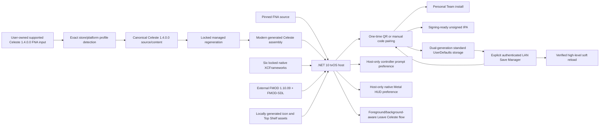

# Project status and architecture

## Current result

The `tvos-port` branch is a working personal-use Apple TV port built locally
from user-owned inputs. The accepted device build runs Celeste 1.4.0.0 with
Metal graphics, real FMOD audio, extended-controller gameplay, and durable
Settings/save slots. It is not an App Store distribution.

The integrated Stage 14 release-candidate audit passed a fresh public-clone
native/managed/full-AOT build, unsigned-package verification, same-identity
physical installation, all-chapter loading, Save Manager/soft reload, real
Apple TV restart, replacement-install, controller, audio, lifecycle, branding,
privacy, and repository gates. See the
[release-candidate record](history/stages/TVOS_RELEASE_CANDIDATE_STAGE14_REPORT.md).
Stage 15 added integrated one-time scan-to-connect QR pairing. Stage 16B added
a live Apple Metal Performance HUD control. Stage 17B adds strict automatic
recognition and canonicalization for eight exact itch.io, Epic Games Store,
and Steam Celeste 1.4.0.0 FNA inputs without changing the shared downstream
tvOS product.

## Proven support matrix

| Area | Proven configuration |
| --- | --- |
| Host | Apple silicon; M1 MacBook Air on macOS 26.3 |
| Apple tools | Xcode 26.6, tvOS SDK 26.5 |
| .NET | SDK 10.0.302, workload set 10.0.302.0 |
| Target | tvOS arm64, minimum tvOS 16.0 |
| Device | Apple TV 4K (3rd generation), `AppleTV14,1` |
| Controller | Sony DualSense |
| Game input | Celeste 1.4.0.0 FNA; eight exact itch.io/Epic/Steam profiles |
| FMOD input | FMOD Engine iOS/tvOS 1.10.09, build 97915 |
| Device build | Release, full AOT, full trimming, no interpreter |

The [input matrix](CELESTE_INPUTS.md) separates physical Apple TV acceptance
from exact canonical-equivalence validation. It does not claim that every
release from a named storefront is supported. Other arm64 Apple TV models,
newer compatible system versions, and extended SDL/FNA controllers may work
but have not received this project's physical acceptance.

## Architecture

### Modern sibling host

The tvOS app lives in `tvos/CelesteTvOSRuntimeHost/` and targets
`net10.0-tvos`. It is isolated from the retained Xamarin.iOS project in
`celestemeow/`. The tvOS lifecycle enters SDL and FNA through the modern .NET
Apple application host and renders through FNA3D Metal.

### Native dependencies

Stage 1 locks and builds SDL2, FNA3D, FAudio, Theorafile, tvStubs, and MoltenVK
for tvOS device and simulator. Each archive member's Apple platform and minimum
OS is checked, variants meet only in XCFrameworks, and native link probes close
without Celeste or FMOD. The accepted logical set SHA-256 is recorded in the
native report and builder.

### Managed regeneration

The repository never carries Celeste source or binaries. A repository-local,
version-locked decompiler reconstructs the user's exact executable under
ignored `.build/` directories. Ordered tracked transforms retarget the result
to modern .NET/FNA and encode focused AOT, serializer, platform, audio, and
persistence adaptations. Input identities, transform counts, and normalized
logical hashes make stale or changed generated output fail closed.

### Audio

Physical-device gameplay uses the generated Celeste FMOD 1.10.20 managed API
against the user-supplied native FMOD 1.10.09 SDK. The accepted path has 489
native exports for the 490 generated declarations; the sole absent API is
unused telemetry and is trimmed. All seven banks are bundled from the user's
game. The arm64 simulator deliberately retains the no-audio path because the
available FMOD 1.10.09 simulator archives are x86_64-only.

### Persistence

Celeste sees normal materialized Settings/save files during execution. The
bridge stores only four allow-listed logical entries—Settings and save slots
0, 1, and 2—in two complete checksummed envelopes under standard app-private
UserDefaults keys. Persistence format v2 independently compresses each present
entry with deterministic zlib level 9, retains compressed and uncompressed
SHA-256 values plus an outer envelope hash, and strictly bounds decompression.
Commits rotate slots, read back and validate, retain the older generation,
enforce a 256 KiB stored total budget, and recover from a corrupt newest slot.

Legacy v0 and production v1 generations remain readable. A v1 install is not
rewritten merely by launching; its next intentional changed save writes v2 to
the older slot and preserves the selected v1 generation until verification is
complete. The physical Chapter 5 save that exceeded the old 32 KiB port limit
now commits and restores successfully.

There is no User Management entitlement. The same standard app domain is
shared between Apple TV users. There is no iCloud, cloud sync, cross-device
sync, or uninstall-survival guarantee.

### Save Manager

The tvOS-only Options entry opens a Celeste-rendered host modal; it does not add
another `Oui` subtype or reflection root. Only that explicit action flushes and
read-back verifies the current Stage 9B generation, then starts a bounded
Network-framework `NWListener` on a system-selected port. The screen presents
the current numeric LAN URL, a new cryptographically random access code, and a
crisp Core Image QR code for the highest-ranked usable numeric LAN address.

The QR carries a separate 256-bit one-time pairing credential in a URL fragment.
A fixed local bootstrap page removes the fragment from the address bar, submits
it to the fixed pairing endpoint, and creates the same normal authenticated
session used by manual six-digit authentication. The credential expires after
three minutes or immediately after one successful use. It is never persisted
or logged. Manual URL/code authentication remains fully supported.

The listener advertises `_celeste-save._tcp` over Bonjour only while open. Its
fixed-purpose HTTP boundary authenticates into an in-memory ten-minute session
and permits one all-files ZIP plus fixed download, validated replace, save-slot
delete, and Settings-reset actions for only `settings`, `0`, `1`, and `2`.
Imported and exported data is the exact ordinary uncompressed `.celeste`
payload validated by the persistence authority; the server cannot see internal
A/B keys or compressed v2 envelopes. A successful mutation blocks stale
gameplay until the Confirm-driven high-level reload verifies the new state.
Background, screen exit, listener failure, shutdown, or twelve minutes of
inactivity stop the listener and erase all credentials. Current Apple platform
documentation does not apply the Local Network privacy authorization prompt to
tvOS; the app still declares its focused Bonjour service and usage description.

### Controller prompts

The generated tvOS Options menu contains a normal Celeste slider for
Automatic, Xbox, PlayStation, Nintendo Switch, and Stadia prompt artwork. It
wraps the existing `Input.GuiInputPrefix` family choice and does not touch
bindings, FNA button values, Settings XML, SaveData, or the Stage 9B envelope.
All four manual families resolve the locked game's complete 24-input matrix;
family-specific assets fall back through Celeste's own `controls/fallback`
paths where designed.

The selected mode is one validated scalar under the standard app-private
`CelesteTvOS.ControllerPrompts.v1` UserDefaults key. Automatic prefers
Celeste/FNA's exact PlayStation, Nintendo, and Stadia GUID knowledge, then the
current Apple Game Controller product category for DualSense, DualShock 4, and
Xbox. Siri Remote categories are excluded, multiple controllers prefer the
current controller and then stable connection order, and unknown controllers
retain Celeste's existing fallback. Nintendo/Stadia automatic selection is not
claimed beyond Celeste's locked known identifiers; their manual modes remain
fully available.

### Metal Performance HUD

The generated tvOS Options menu adds one normal Celeste `OnOff` row named
**Performance HUD**. A force-loaded repository-owned Objective-C constructor
uses public Foundation defaults before SDL/FNA creates the presentation layer
to make Apple's HUD facility available. It sets both Apple's current documented
`MetalHUDForceEnabled` spelling and the historical official Tech Talk
`MetalForceHudEnabled` compatibility spelling because only the latter activated
the accepted physical tvOS release during Stage 16A. No HUD Info.plist key,
private selector, Xcode environment, or device-global Graphics HUD setting is
used.

After `new Celeste()` creates the window and before first draw, the host resolves
the exact SDL `UIWindow` with `SDL_GetWindowWMInfo`, requires its root layer to
be the sole validated `CAMetalLayer`, and compares it with
`SDL_Metal_GetDrawableSize`. The public .NET 10
`CAMetalLayer.DeveloperHudProperties` binding applies either
`mode=disabled` or `mode=default` immediately; `logging=disabled` is fixed in
both states. Missing/invalid preference data resolves Off, and any layer/API
invariant failure keeps gameplay running with the feature unavailable.

Only `Off` or `On` is stored under
`CelesteTvOS.PerformanceHUD.v1` in app-private UserDefaults. It is independent
of Settings XML, SaveData, Stage 9B A/B, Save Manager, and Controller Prompts.
The accepted physical test found no visible default-Off startup flash and no
measurable practical Off-state performance cost.

### Graceful main-menu Quit

The tvOS generated main-menu Quit route is intercepted at its single locked
user-facing call site before `Engine.Exit`. The host waits for an active
`UserIO` save, read-back verifies the Stage 9B durable state, stops any Save
Manager listener, and clears haptics before showing a Celeste-rendered **Leave
Celeste** screen. It deliberately keeps the valid FNA/Celeste runtime alive.

Back dismisses the screen to the existing main menu. If the app genuinely
enters the background, the in-memory Leave state records completion; on a
same-process foreground return the screen is removed and the main menu regains
focus. Merely resigning active is not treated as Home/background completion.
This replaces the former desktop exit path that disposed FNA while leaving an
empty UIKit/SDL application surface.

Save Manager mutations enter a separate stale-write safety state. Confirm now
performs a ticketed high-level soft reload: it re-materializes the exact selected
generation, reloads Settings/Input, clears old SaveData/session state and lands
at a normal main menu in the existing FNA runtime. The guard clears only after
that state verifies. If verification fails, gameplay stays blocked and fully
closing Celeste from the Apple TV app switcher remains the fallback.

### Branding and packaging

`build-tvos.sh` generates a black-backed layered strawberry icon from
`Celeste.png` and static Top Shelf artwork from
`Content/Graphics/SplashScreen.png`, all below ignored roots. Xcode compiles the
asset catalog. The same builder emits either a Personal Team development app
or an unsigned conventional tvOS IPA containing `Payload/Celeste.app`.

## Accepted behavior

- Real Celeste title/gameplay scenes and sustained frames on simulator/device
- Metal on the physical Apple TV GPU
- Title, UI, gameplay, Prologue, cutscene, death/respawn, and lifecycle audio
- DualSense gameplay controls and standard whole-controller rumble
- Artwork-only controller prompt selection, including physically verified
  DualSense Automatic → PlayStation
- Prologue normal and skip transitions
- Settings and three save slots across termination, restart, and replacement
  install with the same app identity
- Transparent v2 compression and the formerly failing Chapter 5 save boundary
- Newest-generation corruption fallback
- Layered icon/parallax and static Top Shelf artwork on physical Apple TV
- Free Personal Team signed installation and verified unsigned IPA structure
- Explicit Save Manager with temporary same-LAN authentication, ordinary-file
  backup, exact validated replacement, slot deletion, and Settings reset
- One-time QR pairing from a phone camera, with manual numeric URL and access
  code retained as a complete fallback
- Confirm-driven Save Manager soft reload with exact generation/hash tickets;
  no second SDL/FNA/FMOD runtime
- Main-menu Quit verifies durable state and provides a safe Home/background
  flow without destroying the FNA runtime or leaving a blank surface
- Apple's native Metal Performance HUD can be shown/hidden live from Options;
  default Off, logging disabled, and no Developer Graphics HUD prerequisite

## Known limitations

- Personal Team development provisioning expires after about seven days.
- Saves are shared between Apple TV users.
- Changing the bundle identifier changes the app/defaults domain.
- Uninstall survival, cloud backup, and cross-device sync are not provided.
- DualSense is the only physically accepted controller; Siri Remote gameplay is
  unsupported.
- Automatic Nintendo Switch/Stadia classification is limited to Celeste's
  locked known controller identities; use the manual prompt choice otherwise.
- Only the exact FNA distributions in the supported-input matrix are accepted;
  arbitrary Steam depots, other stores/versions, XNA, and modified inputs are
  not supported.
- The app is roughly 1.1 GiB before IPA compression.
- Actual atvloadly physical installation has not been project-tested; only the
  conventional unsigned IPA structure is statically verified.
- Save Manager operations are deliberate and local only; there is no unattended
  sync, cloud service, or in-browser XML editor. If soft reload validation fails,
  fully close Celeste from the app switcher and reopen it.
- QR pairing requires a phone/browser that can open ordinary local HTTP URLs;
  an expired or consumed QR falls back to the displayed URL and access code.
- Apple Game Mode is not declared: the current public Apple keys do not document
  tvOS availability, and this project makes no Apple TV Game Mode claim.
- Apple's Metal HUD presentation and metric set are system-controlled and may
  change between tvOS releases; visible diagnostics can carry small overhead.
- No App Store, distribution-profile, paid entitlement, or universal hardware
  claim is made.

## Audit history

The concise [history index](history/README.md) preserves the original plan,
stage-by-stage engineering evidence, failures, corrections, and physical
acceptance records. These historical documents are useful when modifying or
debugging the port but are not required for the normal build workflow.

## Isolation and licensing

Tracked files are host/adapter source, reproducibility locks, focused transforms,
scripts, documentation, and open-source notices. Celeste binaries/content,
generated/decompiled source, FMOD SDK files/banks, generated artwork, app/IPA
products, signing data, and device evidence stay ignored.

The repository root [MIT licence](../LICENSE) covers the source to which it
applies. FNA and each locked native dependency retain their own upstream terms;
exact paths are recorded in `native/tvos-dependencies.lock.json` and generated
licence bundles. FMOD and Celeste remain subject to their respective external
licences and are not relicensed by this project.
