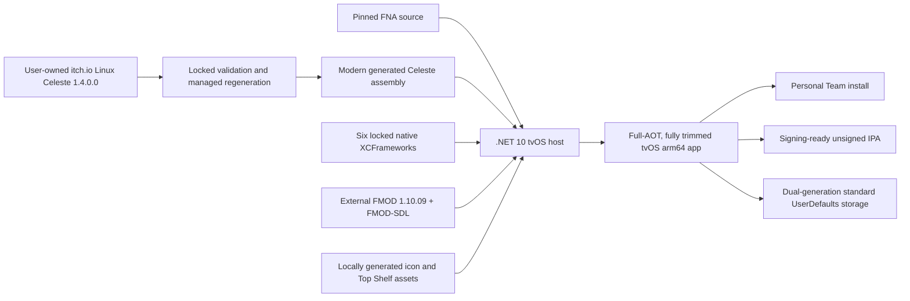

# Project status and architecture

## Current result

The `tvos-port` branch is a working personal-use Apple TV port built locally
from user-owned inputs. The accepted device build runs Celeste 1.4.0.0 with
Metal graphics, real FMOD audio, extended-controller gameplay, and durable
Settings/save slots. It is not an App Store distribution.

## Proven support matrix

| Area | Proven configuration |
| --- | --- |
| Host | Apple silicon; M1 MacBook Air on macOS 26.3 |
| Apple tools | Xcode 26.6, tvOS SDK 26.5 |
| .NET | SDK 10.0.302, workload set 10.0.302.0 |
| Target | tvOS arm64, minimum tvOS 16.0 |
| Device | Apple TV 4K (3rd generation), `AppleTV14,1` |
| Controller | Sony DualSense |
| Game input | Unmodified Celeste 1.4.0.0, itch.io Linux download |
| FMOD input | FMOD Engine iOS/tvOS 1.10.09, build 97915 |
| Device build | Release, full AOT, full trimming, no interpreter |

Steam and other Celeste distributions are untested. Another distribution may
work only if the exact validator accepts byte-identical required files. Other
arm64 Apple TV models, newer compatible system versions, and extended SDL/FNA
controllers may work but have not received this project's physical acceptance.

## Architecture

### Modern sibling host

The tvOS app lives in `tvos/CelesteTvOSRuntimeHost/` and targets
`net10.0-tvos`. It is isolated from the retained Xamarin.iOS project in
`celestemeow/`. The tvOS lifecycle enters SDL and FNA through the modern .NET
Apple application host and renders through FNA3D Metal.

### Native dependencies

Stage 1 locks and builds SDL2, FNA3D, FAudio, Theorafile, tvStubs, and MoltenVK
for tvOS device and simulator. Each archive member's Apple platform and minimum
OS is checked, variants meet only in XCFrameworks, and native link probes close
without Celeste or FMOD. The accepted logical set SHA-256 is recorded in the
native report and builder.

### Managed regeneration

The repository never carries Celeste source or binaries. A repository-local,
version-locked decompiler reconstructs the user's exact executable under
ignored `.build/` directories. Ordered tracked transforms retarget the result
to modern .NET/FNA and encode focused AOT, serializer, platform, audio, and
persistence adaptations. Input identities, transform counts, and normalized
logical hashes make stale or changed generated output fail closed.

### Audio

Physical-device gameplay uses the generated Celeste FMOD 1.10.20 managed API
against the user-supplied native FMOD 1.10.09 SDK. The accepted path has 489
native exports for the 490 generated declarations; the sole absent API is
unused telemetry and is trimmed. All seven banks are bundled from the user's
game. The arm64 simulator deliberately retains the no-audio path because the
available FMOD 1.10.09 simulator archives are x86_64-only.

### Persistence

Celeste sees normal materialized Settings/save files during execution. The
bridge stores only four allow-listed logical entries—Settings and save slots
0, 1, and 2—in two complete checksummed envelopes under standard app-private
UserDefaults keys. Commits rotate slots, read back and validate, retain the
older generation, enforce a 256 KiB total budget, and recover from a corrupt
newest slot.

There is no User Management entitlement. The same standard app domain is
shared between Apple TV users. There is no iCloud, cloud sync, cross-device
sync, or uninstall-survival guarantee.

### Branding and packaging

`build-tvos.sh` generates a black-backed layered strawberry icon from
`Celeste.png` and static Top Shelf artwork from
`Content/Graphics/SplashScreen.png`, all below ignored roots. Xcode compiles the
asset catalog. The same builder emits either a Personal Team development app
or an unsigned conventional tvOS IPA containing `Payload/Celeste.app`.

## Accepted behavior

- Real Celeste title/gameplay scenes and sustained frames on simulator/device
- Metal on the physical Apple TV GPU
- Title, UI, gameplay, Prologue, cutscene, death/respawn, and lifecycle audio
- DualSense gameplay controls and standard whole-controller rumble
- Prologue normal and skip transitions
- Settings and three save slots across termination, restart, and replacement
  install with the same app identity
- Newest-generation corruption fallback
- Layered icon/parallax and static Top Shelf artwork on physical Apple TV
- Free Personal Team signed installation and verified unsigned IPA structure

## Known limitations

- Personal Team development provisioning expires after about seven days.
- Saves are shared between Apple TV users.
- Changing the bundle identifier changes the app/defaults domain.
- Uninstall survival, cloud backup, and cross-device sync are not provided.
- DualSense is the only physically accepted controller; Siri Remote gameplay is
  unsupported.
- Steam and other Celeste distributions are untested.
- The app is roughly 1.1 GiB before IPA compression.
- Actual atvloadly physical installation has not been project-tested; only the
  conventional unsigned IPA structure is statically verified.
- No App Store, distribution-profile, paid entitlement, or universal hardware
  claim is made.

## Audit history

These reports preserve the evidence and stage-by-stage decisions. Users do not
need them for normal builds.

- [Initial feasibility and port plan](../TVOS_PORT_PLAN.md)
- [Native dependency pipeline](../TVOS_NATIVE_BUILD_REPORT.md)
- [Modern FNA host](../TVOS_HOST_STAGE2_REPORT.md)
- [Managed retarget](../TVOS_CELESTE_MANAGED_STAGE3A_REPORT.md)
- [First real Celeste frame](../TVOS_CELESTE_RUNTIME_STAGE3B_REPORT.md)
- [Prologue/save/haptic correction](../TVOS_CELESTE_PROLOGUE_STAGE3C_REPORT.md)
- [FMOD diagnostic](../TVOS_FMOD_DIAGNOSTIC_STAGE5A_REPORT.md)
- [Normal gameplay audio](../TVOS_CELESTE_AUDIO_STAGE5B_REPORT.md)
- [Durable persistence](../TVOS_CELESTE_PERSISTENCE_STAGE6_REPORT.md)
- [Friendly self-build and branding](../TVOS_SELF_BUILD_STAGE8A_REPORT.md)
- [Public repository release](../TVOS_REPOSITORY_RELEASE_STAGE8B_REPORT.md)

## Isolation and licensing

Tracked files are host/adapter source, reproducibility locks, focused transforms,
scripts, documentation, and open-source notices. Celeste binaries/content,
generated/decompiled source, FMOD SDK files/banks, generated artwork, app/IPA
products, signing data, and device evidence stay ignored.

The repository root [MIT licence](../LICENSE) covers the source to which it
applies. FNA and each locked native dependency retain their own upstream terms;
exact paths are recorded in `native/tvos-dependencies.lock.json` and generated
licence bundles. FMOD and Celeste remain subject to their respective external
licences and are not relicensed by this project.
